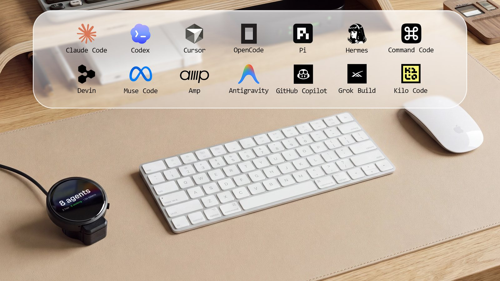
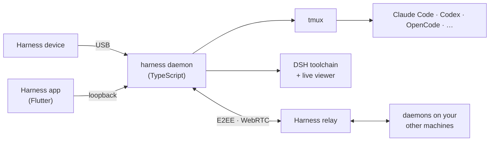
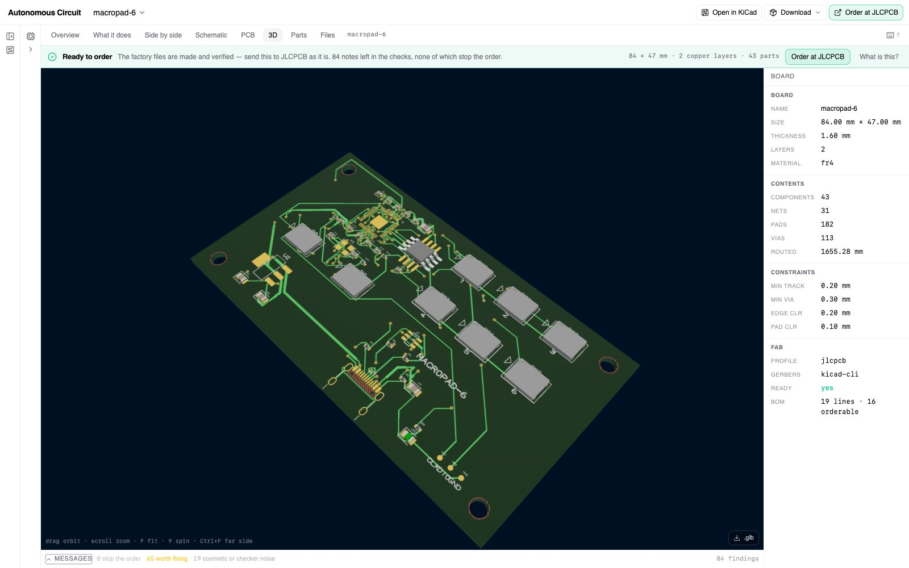
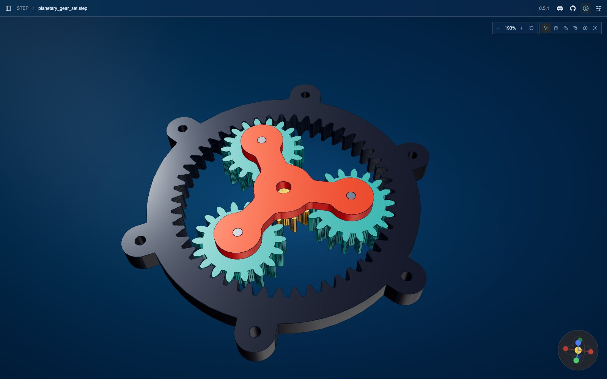
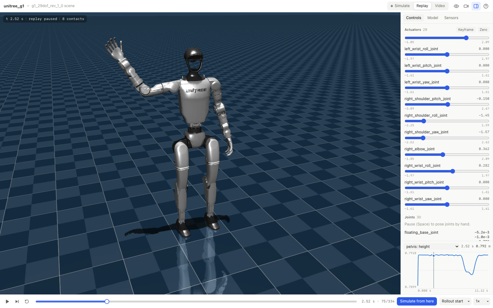
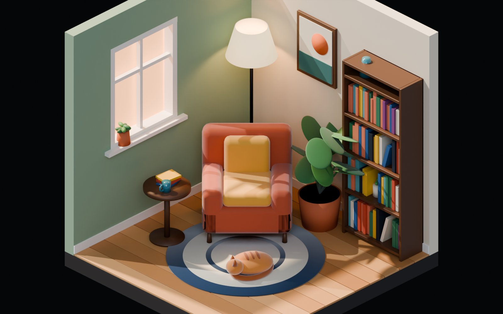
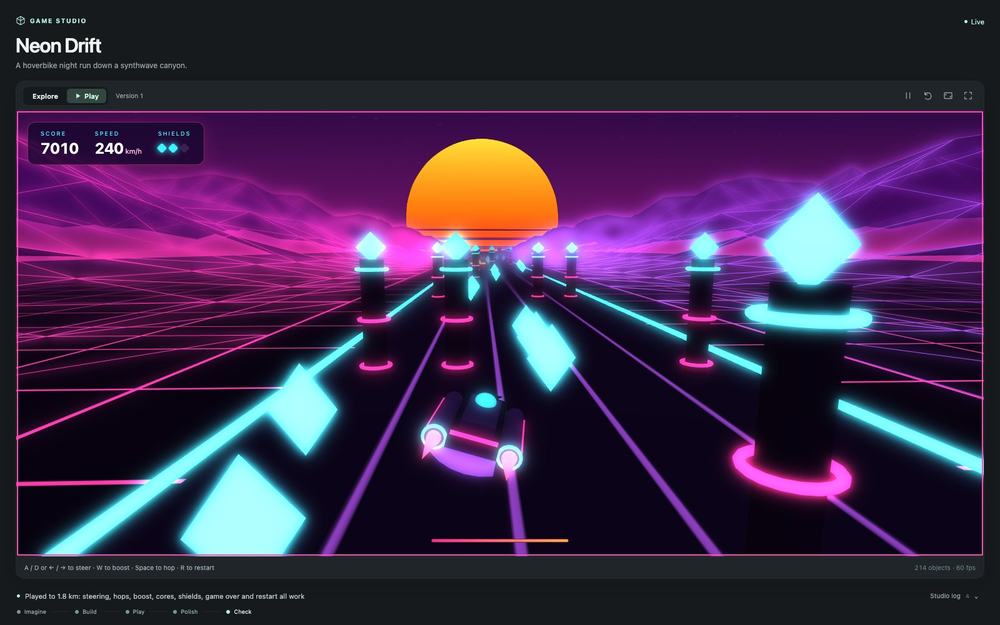
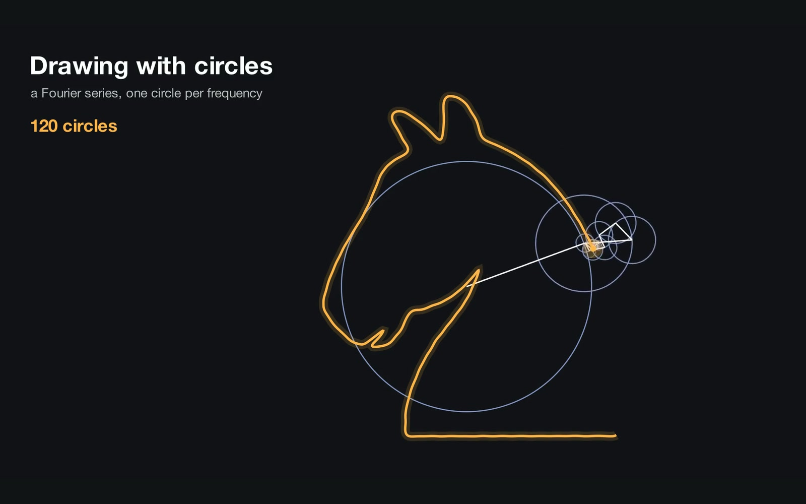

# OpenHarness

**The open-source software and hardware platform for domain-specific harnesses.**

> **Community Windows 11 preview:** this fork adds a native Windows desktop with
> a WSL2 backend and a matching bundled CLI. [Download the Windows preview](https://github.com/mcs-eng/autonomous-harness/releases)
> · [Setup and limitations](desktop/WINDOWS_QUICKSTART.md).
> Independent MIT-licensed fork of Autonomous's OpenHarness; not an official
> Autonomous Windows release. The upstream project is described below.

Harness is a desktop app for the coding agents you already run — Claude Code, Codex, Cursor, and
eleven more — on every machine you own, in one window. Each agent is a tmux pane on the machine it
runs on, kept there by a small daemon (`harness`). The window attaches to those panes, from this
computer or from any other, with everything between machines encrypted end to end. An optional USB
device puts the same agents on your desk.

Run Claude Code, Codex, and every other coding agent in persistent terminals on all your machines. Give
them a **domain-specific harness (DSH)** and they design circuit boards, model 3D parts, simulate
robots, and build games in a live viewer. Keep them on your desk with the open-hardware
**Harness device**.

[Run it](#run-it) · [Domain-specific harnesses](#domain-specific-harnesses-dsh) ·
[Harness device](#harness-device) · [Architecture](docs/architecture.md) · [Contribute](#contributing)

<p align="center">
  
</p>

## Coding agents, on every machine

The coding agent is still the heart of the work, and OpenHarness is built around it.

- **Real terminals that outlive the window.** Every agent runs in a persistent tmux session. Close the
  app and the agents keep working; if tmux goes down with a reboot, the daemon brings the panes back and
  resumes the sessions.
- **Every engine, no wrappers.** Claude Code, Codex, Cursor, OpenCode, Pi, Hermes, Command Code, Devin,
  Muse Code, Amp, Kilo, Grok Build, Antigravity and GitHub Copilot. OpenHarness reads the transcript each
  agent already writes and installs the vendor's own hooks. Your credentials stay in `~/.claude`, `~/.codex` and
  so on. See the [engine list](docs/engines.md).
- **All your machines in one window.** The laptop, the Mac mini at home, the server in the rack. Each
  runs a daemon with outbound connections only. Terminal traffic is end-to-end encrypted, the relay only
  forwards ciphertext, and it goes peer to peer over WebRTC when it can. No SSH server, VPN, or open
  port.
- **Built for many agents at once.** Split panes, a keyboard-driven layout, fuzzy search across
  sessions and machines (**⌘O**), and one shortcut to the agents waiting on you (**⇧⌘I**). The
  [workspace guide](docs/app.md) and [keybindings](docs/keyboard.md) cover the rest.

<p align="center">


</p>


### Run it

1. [Download the desktop app](https://harness.autonomous.ai/desktop) for macOS or Linux.
2. Sign in to a coding agent you already use, with your own subscription, API key, or local model.
3. Press **⌘N**, pick an agent or a harness, a machine and a project, and start.

On another machine:

```bash
curl -fsSL https://harness.autonomous.ai/cli/install.sh | bash
harness login
harness start
```

Then **Machines → Link Machine** in the app.

macOS is the primary tested platform. Linux builds exist and feature parity is in progress; Windows is
work in progress. The app and daemon still need a Harness account to start;
[account-free local use is tracked](docs/development.md#account-free-local-use).

<details>
<summary><b>Build from source</b></summary>

For macOS, install Node.js 20+, tmux, Xcode, and Flutter 3.47+ / Dart 3.13+:

```bash
git clone https://github.com/autonomous-ai/openharness.git
cd openharness
(cd cli && npm ci)
make install-cli
cd desktop
flutter config --enable-swift-package-manager
flutter pub get
flutter run -d macos
```

`make install-cli` installs this checkout's CLI and restarts the local daemon. The
[development guide](docs/development.md) covers tests and isolated environments.

</details>

### How it fits together



The [architecture guide](docs/architecture.md) covers the daemon, the session model, transport and
encryption.

## Domain-specific harnesses (DSH)


A **domain-specific harness** turns a coding agent into a specialist. It brings the domain's
instructions and skills, a pinned toolchain, a project template, a verdict the app can read, and a
**live viewer** for what the agent makes. You chat on one side; the board, the part, the robot or the
game takes shape on the other, and stays interactive after the agent is done.

A DSH is a folder with a `harness.json`. The agent does the reasoning; the harness brings the tools
and the view. Adding a domain never needs a change to the app or the daemon.

### 18 harnesses today


| Domain | Harnesses |
|---|---|
| CAD | [Autonomous Workshop](store/agents/autonomous-workshop/), [text-to-cad](store/agents/text-to-cad/) |
| 3D | [Blender](store/agents/blender/) |
| Electronics | [Autonomous Circuit](store/agents/autonomous-circuit/), [CircuitJS](store/agents/circuitjs/), [Yosys](store/agents/yosys/) |
| Games | [Godogen](store/agents/godogen/), [Phaser](store/agents/phaser/) |
| Documents and diagrams | [Marp](store/agents/marp/), [Typst](store/agents/typst/), [Excalidraw](store/agents/excalidraw/) |
| Video and music | [OpenMontage](store/agents/openmontage/), [Remotion](store/agents/remotion/), [Manim](store/agents/manim/), [Strudel](store/agents/strudel/) |
| Simulation and analysis | [MuJoCo](store/agents/mujoco/), [RDKit](store/agents/rdkit/), [marimo](store/agents/marimo/) |

Each one wraps an open-source project under its own name, credits it, pins its toolchain, and installs
on a fresh machine from the Harness Store. Eight [shared viewers](store/viewers/) (CAD, 3D models,
documents, games, film, video, MuJoCo, web) mean a new harness rarely needs to write its own.

**The harness we'd love to see next is the one for the tool you use.** KiCad, FreeCAD, OpenSCAD, Godot,
Jupyter, QGIS, Home Assistant, LilyPond, Inkscape — or your own company's toolchain. A harness can live
in this repository or in yours.

<table>
  <tr>
    <td width="33%" valign="top">
      <a href="store/agents/autonomous-circuit/"></a>
      <b>Autonomous Circuit</b><br/><sub><i>“Design a six-key USB macropad. Start with the schematic.”</i> A fab-ready board: RP2040, 43 parts.</sub>
    </td>
    <td width="33%" valign="top">
      <a href="store/agents/text-to-cad/"></a>
      <b>text-to-cad</b><br/><sub><i>“Design a 3D-printable planetary gear set: a 12-tooth sun, three 18-tooth planets…”</i> Nine parts, zero interference.</sub>
    </td>
    <td width="33%" valign="top">
      <a href="store/agents/mujoco/"></a>
      <b>MuJoCo</b><br/><sub><i>“Make the Unitree G1 humanoid say hello: stand, raise its right hand and wave…”</i> A 29-servo rollout.</sub>
    </td>
  </tr>
  <tr>
    <td width="33%" valign="top">
      <a href="store/agents/blender/"></a>
      <b>Blender</b><br/><sub><i>“Make a cozy isometric reading nook: a cut-away corner of a room with an armchair…”</i> 122 named objects.</sub>
    </td>
    <td width="33%" valign="top">
      <a href="store/agents/godogen/"></a>
      <b>Godogen</b><br/><sub><i>“Make a synthwave hoverbike racer: ride down a neon grid canyon toward a striped setting sun…”</i> Playable in the pane.</sub>
    </td>
    <td width="33%" valign="top">
      <a href="store/agents/manim/"></a>
      <b>Manim</b><br/><sub><i>“Draw a chess knight using nothing but spinning circles…”</i> 120 epicycles in gold.</sub>
    </td>
  </tr>
</table>

Every picture is real output from the harness's own toolchain, and the prompt is the one that made it.

### Your first DSH in ten minutes

The [Hello World example](store/examples/hello-world/) is a Codex session that edits an HTML page
shown in the shared Web Viewer:

```text
hello-world/
  harness.json
  AGENTS.md             # instructions for the agent
  template/index.html   # copied into a new project
```

Its manifest connects the pieces:

```json
{
  "spec": 1,
  "id": "examples/hello-world",
  "name": "Hello World",
  "engine": "codex",
  "workspace": {
    "template": "template",
    "marker": "index.html"
  },
  "agent": { "instructions": "AGENTS.md" },
  "viewer": { "use": "autonomous/web-viewer" }
}
```

The CLI and the package protocol call a harness a DSH, so the commands are `harness dsh …`. From this
checkout, with the `harness` CLI installed:

```bash
harness dsh install "$PWD/store/viewers/web-viewer" --link
cp -R store/examples/hello-world ../my-first-harness
harness dsh check ../my-first-harness
harness dsh install ../my-first-harness --link
```

Press **⌘N → Hello World**, choose a new project, and ask it to “Say hello to Ada.” The agent edits
`index.html`; the viewer reloads. Change `AGENTS.md` to try another workflow, then start a new session.
`--link` keeps the package connected to your source directory; Store installs resolve viewer
dependencies on their own.

The [authoring guide](store/README.md) covers the full manifest, toolchains, live progress, verdicts,
store pages, and publishing; the [package specification](store/spec/README.md) is the contract.

| Piece | Responsibility |
|---|---|
| Engine | Runs the coding agent: Claude Code, Codex, OpenCode, and the rest |
| Harness (DSH) | Packages a domain: engine, instructions, toolchain, workspace, and viewer |
| Viewer | Shows and interacts with what the agent makes; shared across harnesses |
| Session | One running agent, in one project, on one machine |

## Harness device

<p align="center">
  
</p>

No other agent stack ships this layer. The **Harness device** is a round, always-on display that sits beside
your keyboard and shows your agents at a glance: what each one is doing, which one has finished, and
which one is waiting on you. Read a question and answer it on the screen, or tap and speak a new task,
without switching windows.

It is open hardware, all the way down. This repository has everything it takes to build one:

| Layer | What's here |
|---|---|
| [Firmware](devices/harness-device/firmware/) | ESP32-S3, ESP-IDF, a 466 × 466 round AMOLED with touch, microphones and audio. Connects to the host's daemon over USB — no Wi-Fi setup, no account on the device. |
| [PCB](devices/harness-device/hardware/pcb/) | The EasyEDA Pro project, the schematic, Gerbers, the bill of materials, and pick-and-place data for assembly. |
| [Enclosure](devices/harness-device/hardware/3d/) | STEP for editing and STL for printing: the housing, an iron counterweight base, the USB clamp, and the button. |

[**Get a Harness device**](https://www.autonomous.ai/harness), or build your own from these files. The
[firmware guide](devices/harness-device/firmware/README.md) lists the supported boards and build
commands, and the [hardware guide](devices/harness-device/hardware/README.md) covers the design files.

https://github.com/user-attachments/assets/97848065-61c6-40df-be66-a8247f69aa4c

## Contributing

There are three ways in, one for each layer of the stack.

- **Make a DSH for a tool you use.** Start from Hello World, make one workflow work end to end, pin the
  toolchain, credit the upstream project, and show something worth looking at in the viewer.
- **Improve the coding workspace.** Terminal behavior, engine support, the daemon, the relay, Linux and
  Windows.
- **Hack the hardware.** Port the firmware to another board, remix the enclosure, add a feature to the
  device.

Small fixes and notes about something that didn't work are welcome too. The
[contribution guide](CONTRIBUTING.md) walks through each path.

## Repository map

```text
desktop/    Flutter app and terminal workspace
cli/        TypeScript CLI, daemon, engine adapters, and package runtime
backend/    Relay and control plane
store/      Domain-specific harnesses, shared viewers, registry, examples, and package spec
provider/   Provider API contract, implementations, and conformance tests
devices/    Harness device firmware, PCB, and enclosure
```

- [Development and testing](docs/development.md) · [Extension points](docs/extending.md) · [CLI and automation](docs/cli.md)
- [Desktop](desktop/README.md) · [Daemon](cli/README.md) · [Relay](backend/README.md) · [Provider API](provider/README.md)
- [Security policy](SECURITY.md) · [License](LICENSE)

The repository is MIT licensed unless a folder says otherwise. Upstream tools, models, and assets keep
their own licenses.
