<p align="center">
  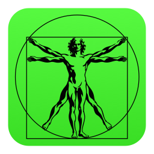
</p>

<h1 align="center">Harness like a boss.</h1>

<p align="center">
  <b>The ultimate harness for coding agents and beyond.</b><br>
  Claude Code at work. Codex at home. Hermes in the cloud. One command center.<br>
  Start with code. Then follow your curiosity and build across disciplines: CAD, circuits, robots, games and music.
</p>

<p align="center">
  <a href="https://harness.autonomous.ai/desktop"><b>Download</b></a> ·
  <a href="#how-it-works">How it works</a> ·
  <a href="#beyond-code">Beyond code</a> ·
  <a href="#domain-specific-harnesses-dsh">Harnesses</a> ·
  <a href="#harness-device">Device</a>
</p>

> **Community Windows 11 preview:** this fork adds a native Windows desktop with
> a WSL2 backend and a matching bundled CLI. [Download the Windows preview](https://github.com/mcs-eng/autonomous-harness/releases)
> · [Setup and limitations](desktop/WINDOWS_QUICKSTART.md).
> Independent MIT-licensed fork of Autonomous's OpenHarness; not an official
> Autonomous Windows release. The upstream project is described below.

### Every agent, side by side

Claude Code, Codex, Cursor, OpenCode, Devin, Amp, Copilot and seven more.

<p align="center">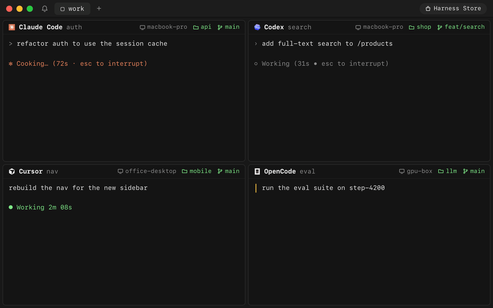</p>

### Every machine, side by side

Your laptop, home server and GPU box in one window. Link each one with a password.
No SSH keys. No Tailscale. No port forwarding.

<p align="center">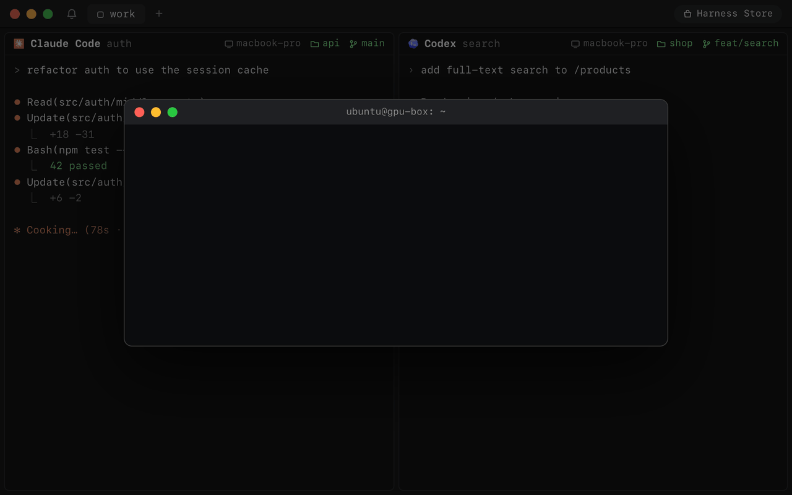</p>

### Keyboard first

⌘O finds any session on any machine. ⇧⌘I jumps to the agent waiting on you. ⌘D splits. Every key remaps.

<p align="center">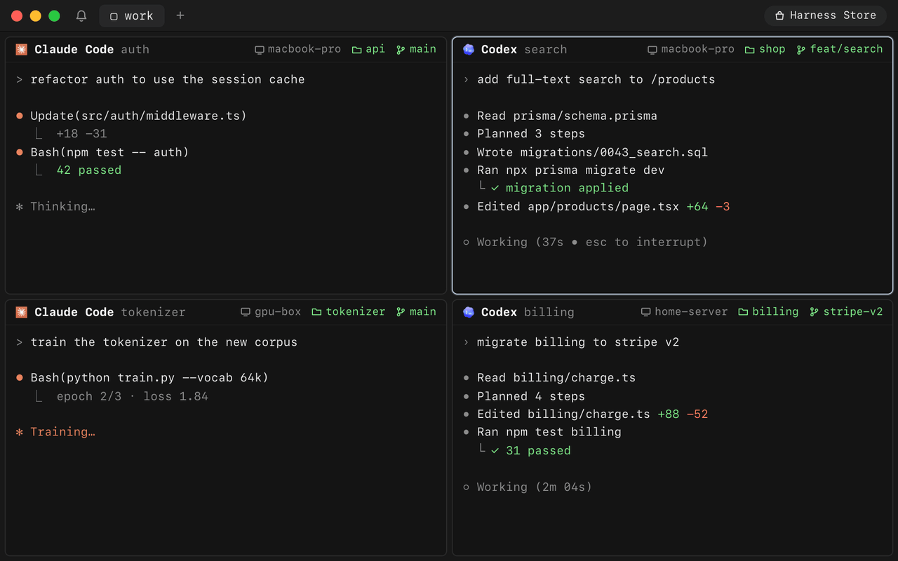</p>

### End-to-end encrypted

Code, keys and keystrokes are sealed on your machine. The relay forwards bytes it can't read.

<p align="center">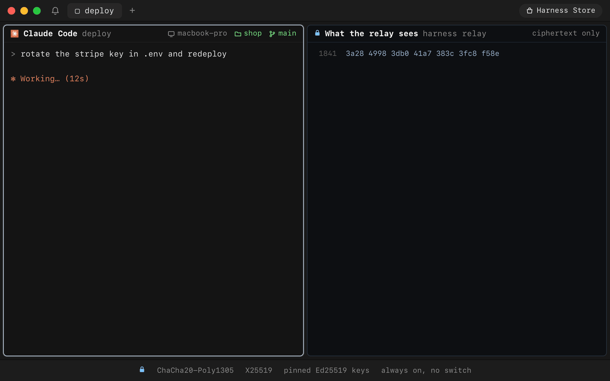</p>

### Fast and light

A native app, not Electron. Close it and your agents keep working.

We measure the workflows developers repeat, including their slow tails. Release
build on an M2 Max; 120 observations per action, with 16 retained terminals and
four visible:

| Developer action | Idle median | Idle p95 | p95 during output |
|---|---:|---:|---:|
| Type → terminal echo | 11.2 ms | 18.5 ms | 74.2 ms |
| ⌘N input-ready new harness | 10.6 ms | 15.0 ms | 14.4 ms |
| ⌘O open anything | 12.3 ms | 16.1 ms | 16.9 ms |
| Filter the session picker | 10.0 ms | 13.6 ms | 14.9 ms |
| Select a session → first input echo | 26.1 ms | 31.1 ms | 35.9 ms |
| ⌘T new tab | 13.2 ms | 18.1 ms | 18.0 ms |
| Next tab → first input echo | 27.2 ms | 34.2 ms | 42.6 ms |
| Focus pane → first input echo | 23.9 ms | 30.6 ms | 37.3 ms |
| Zoom a pane | 55.3 ms | 100.9 ms | 326.0 ms |
| Type Find query → results | 10.1 ms | 13.1 ms | 14.0 ms |
| Scroll one viewport | 40.9 ms | 83.2 ms | 139.6 ms |

Framework input to completed Flutter raster, with verified focus and results.
Output is an eight-row ANSI redraw at 20 Hz. These use synthetic sessions;
physical keyboard, network and display-presentation time are excluded.
Output-heavy typing, zoom and scrolling remain the main latency targets.

Real terminal round trips are measured separately, through disposable PTYs on
actual machines. The local installed-daemon baseline is **1.1 ms median / 7.2 ms
p95**, or 11.1 ms p95 during output (600 echoes per workload).

For remote machines, we compare all three routes on the **same target** and verify
the nominated ICE pair and both binary wire directions. Three attempts per route;
200 echoes per workload per successful trial:

| Target / route | Idle median | Idle p95 | p95 during output | Trials completed |
|---|---:|---:|---:|---:|
| Office iMac · Direct P2P | 14.6 ms | 135.0 ms | 37.7 ms | 1/3 |
| Office iMac · Cloudflare TURN | 109.8 ms | 163.8 ms | 175.9 ms | 3/3 |
| Office iMac · Harness relay | 401.4 ms | 504.7 ms | 512.0 ms | 3/3 |
| Home iMac · Direct P2P | Unavailable | — | — | 0/3 |
| Home iMac · Cloudflare TURN | 108.5 ms | 167.8 ms | 180.2 ms | 3/3 |
| Home iMac · Harness relay | 384.7 ms | 503.3 ms | 501.1 ms | 3/3 |

Direct P2P was fast when it connected, but its availability varied in this run.
All five failed direct-only attempts reached their PTYs through the fallback
relay; they are retained as unavailable P2P trials. All 5,200 measured echoes and
390 measured control requests completed, and all 18 test terminals were deleted.

Remote trials use an isolated production transport client. These round trips
exclude UI rendering; adding independent p95 values would not produce an
end-to-end p95. Setup and warm reattachment are measured separately.
[Route methodology, failures, tails and raw observations](docs/performance/2026-09-23-transport-routes.md).

Desktop app resource use with 1,000 seeded lines per retained terminal:

| Retained terminals | App foreground / hidden CPU | App foreground / hidden footprint |
|---|---:|---:|
| 1 | 0.08% / 0.08% | 213 / 217 MiB |
| 16 | 0.09% / 0.10% | 304 / 306 MiB |
| 48 | 0.10% / 0.08% | 559 / 559 MiB |

Thirty-second process snapshots; 100% CPU means one core. Memory is median
physical footprint of the **desktop app alone**, including its terminal renderer
and scrollback. The 213 MiB one-terminal result contains no Claude Code, Codex,
shell, tmux, or Harness daemon process memory. Those need separate process
measurements; their usage was not measured in this fixture. Hidden fixtures still
recorded 12–14 interrupt wakeups/s; these measurements do not establish zero background
work in a connected app.

With 16 full 10,000-line buffers and ongoing output, the fixture used about
957 / 960 MiB and 1.28% / 1.79% of one core in foreground / hidden samples.

[Full results, workload definitions, limits and raw observations](docs/performance/2026-09-23-core-experiences.md).

### Built the way developers work

- **Real terminals.** Every agent runs in its own tmux pane. Scrollback, colors and keys just work.
- **Your CLIs, as they are.** Harness never wraps an agent. It reads transcripts and uses the vendor's own hooks.
- **A worktree per harness.** Start an agent on its own branch. Your working copy stays clean.
- **Remap every key.** One JSONC file, reloaded on save. Chords up to four strokes.
- **Local models.** Run open-weight models on your own machines with Grid, Ollama, MLX-LM and vLLM.
- **Bytes, not pixels.** Remote terminals stream text peer to peer. No remote desktop.
- **Open source, all of it.** App, CLI, daemon, relay and device, in this repo.

## How it works

One daemon per machine runs your agents in tmux. It dials out, so no machine opens a port.

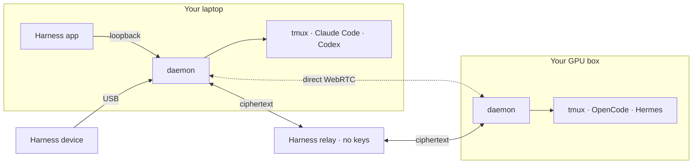

Every path is sealed end to end: ChaCha20-Poly1305, X25519 session keys, pinned Ed25519 identities.
Harness picks the best path on its own.

**Direct.** A WebRTC channel between your machines. No server in the path.

<p align="center">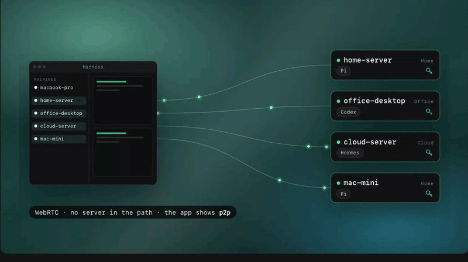</p>

**Through Cloudflare.** When a firewall blocks the direct path, the same encrypted channel runs over
Cloudflare's TURN network. Harness keeps trying for a direct path.

<p align="center">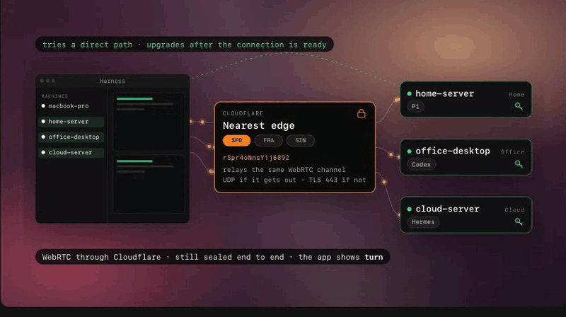</p>

**Through our relay.** A fallback while WebRTC negotiates. The relay holds no keys and forwards ciphertext.

<p align="center">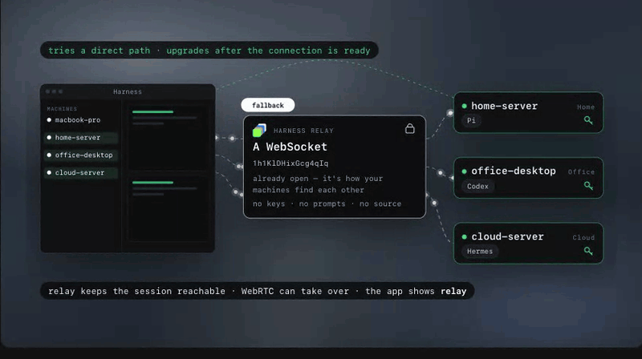</p>

The [architecture guide](docs/architecture.md) has the details.

<a id="run-it"></a>
## Get started

**[Download the app](https://harness.autonomous.ai/desktop)** for macOS or Linux.

Add a machine. Run this on it, then **Machines → Link Machine** in the app:

```bash
curl -fsSL https://harness.autonomous.ai/cli/install.sh | bash
harness login
harness remote-password set
harness start
```

<details>
<summary><b>Build from source</b></summary>

Needs Node.js 20+, tmux, Xcode and Flutter 3.47+ / Dart 3.13+:

```bash
git clone https://github.com/autonomous-ai/openharness.git
cd openharness
(cd cli && npm ci)
make install-cli
cd desktop
flutter config --enable-swift-package-manager
flutter pub get
flutter run -d macos
```

`make install-cli` installs this checkout's CLI and restarts the local daemon. See the
[development guide](docs/development.md).

</details>

<a id="beyond-code"></a>
## Beyond code: Build across disciplines

> “World-class entrepreneurs are polymaths.” — [Peter Thiel](https://www.youtube.com/watch?v=h10kXgTdhNU&t=811s)

Coding agents can build far more than software. Give one a harness and it works with the real
tools of a craft. You steer in a live viewer. Every clip below is a real session.

### Beyond code: Design

**[Blender](store/agents/blender/).** Ask for a lamp and the sliders that matter. Turn them and Blender rebuilds the geometry. Keep the versions you love.

<p align="center">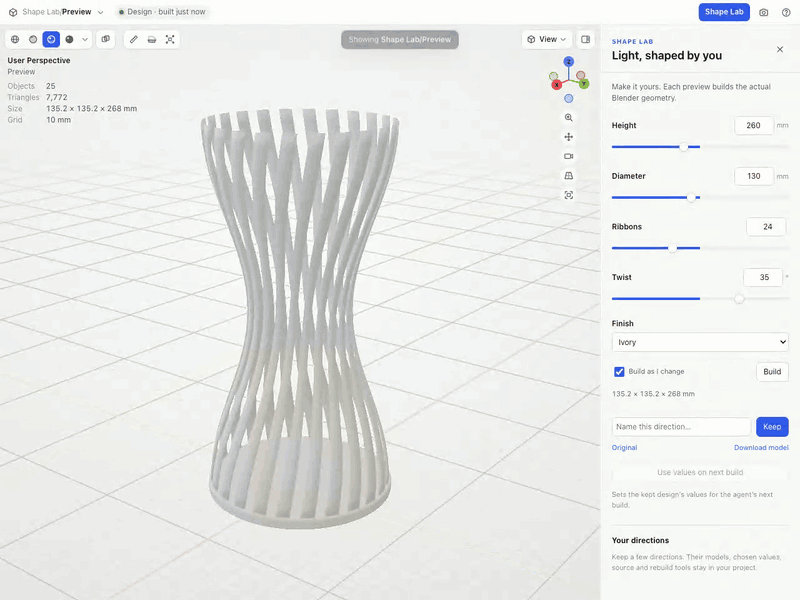</p>

### Beyond code: Circuits

**[CircuitJS](store/agents/circuitjs/).** Build a filter. Change one resistor. Overlay the new trace, measure the difference and keep both.

<p align="center"></p>

### Beyond code: Robotics

**[MuJoCo](store/agents/mujoco/).** Pin a moment in a robot's run. Shove it with 100 N. Watch two futures split.

<p align="center">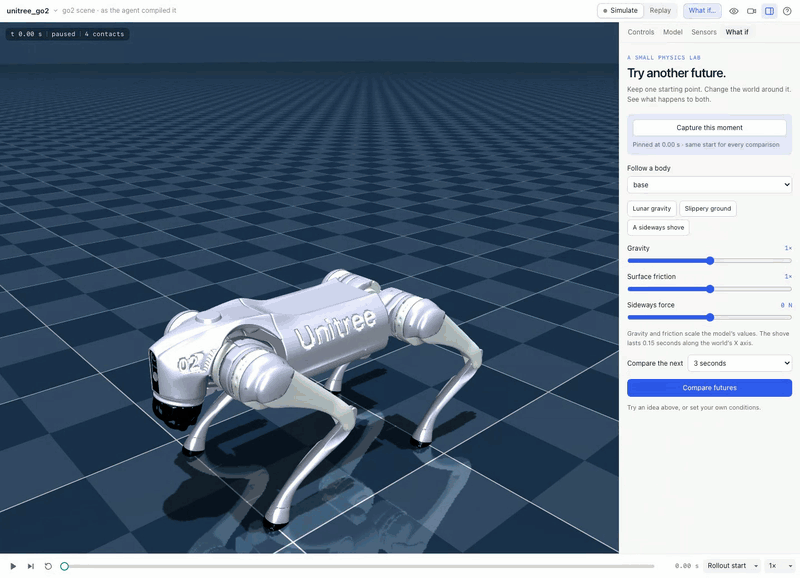</p>

### Beyond code: Games

**[Godogen](store/agents/godogen/).** Your agent makes a playable game. Miss a jump, rewind, try again. Pin the moment so the agent sees what you mean.

<p align="center">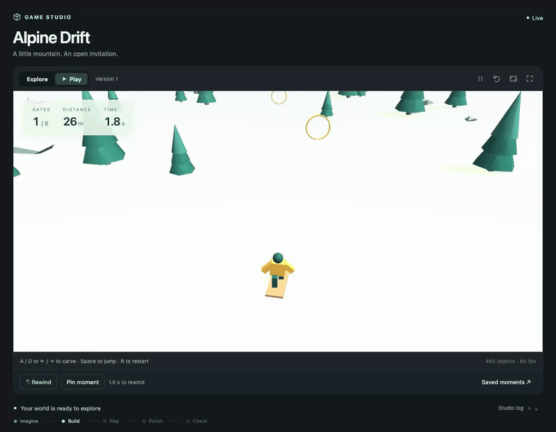</p>

### Beyond code: Music

**[Strudel](store/agents/strudel/).** The track is code you can perform. Bring voices in and out, mark the good parts, keep the WAV. [Hear it](https://github.com/user-attachments/assets/a3d4381b-5f55-406c-9d68-330cd8792fc5).

<p align="center"></p>

### Beyond code: Chemistry

**[RDKit](store/agents/rdkit/).** Turn a bond and watch the molecule move. Follow the real energy curve. Keep the pose worth a closer look.

<p align="center">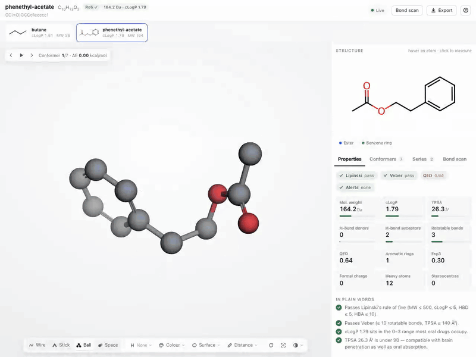</p>

### Beyond code: Documents

**[Typst](store/agents/typst/).** Your agent writes a real PDF. Circle a detail, quote a line, leave a note. The next draft answers it.

<p align="center"></p>

### Beyond code: Data

**[Jev Sheets](store/agents/jev-sheets/).** Test a question on a few frozen rows before you ask the whole sheet. Compare two wordings side by side.

<p align="center">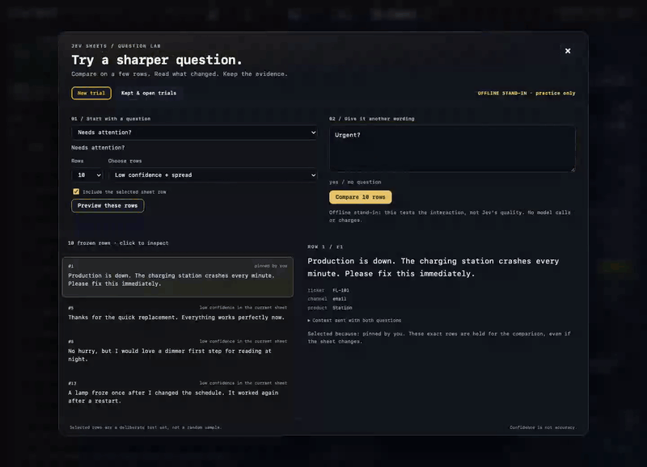</p>

## Domain-specific harnesses (DSH)

Code is the common medium. Geometry scripts make parts. Netlists make boards. Animation code makes film.

A **domain-specific harness** turns a coding agent into a specialist. It brings the craft's
instructions and skills, a pinned toolchain, a project template, checks and a **live viewer**.
You chat on one side. The board, the part or the game takes shape on the other.

The agent does the reasoning. The harness brings the tools and the view. It's a folder with a
`harness.json`, so adding a craft never touches the app.

<!-- store-catalog:start -->
### 49 harnesses in the Store

| Category | Agents and harnesses |
|---|---|
| **Coding** | [Claude Code, Codex, Cursor, OpenCode, Pi, Hermes, Command Code, Devin, Muse Code, Amp, Antigravity, GitHub Copilot, Grok Build, Kilo Code](docs/engines.md), [Harness Monitor](store/agents/harness-monitor/), [Machine Monitor](store/agents/machine-monitor/) |
| Design | [Autonomous Workshop](store/agents/autonomous-workshop/), [Blender](store/agents/blender/), [Bonsai MCP](store/agents/bonsai-mcp/), [Creative Direction](store/agents/creative-direction/), [Excalidraw](store/agents/excalidraw/), [FreeCAD](store/agents/freecad/), [Generative Art](store/agents/generative-art/), [OpenSCAD](store/agents/openscad/), [text-to-cad](store/agents/text-to-cad/) |
| Engineering | [Autonomous Circuit](store/agents/autonomous-circuit/), [CircuitJS](store/agents/circuitjs/), [Home Assistant](store/agents/home-assistant/), [KiCad](store/agents/kicad/), [Orca Slicer](store/agents/orca-slicer/), [Yosys](store/agents/yosys/) |
| Media | [Comfy MCP](store/agents/comfy-mcp/), [Manim](store/agents/manim/), [OpenMontage](store/agents/openmontage/), [Remotion](store/agents/remotion/) |
| Music | [Ableton AI](store/agents/ableton-ai/), [JUCE Agent Toolkit](store/agents/juce-agent-toolkit/), [Music Studio](store/agents/music-studio/), [Score](store/agents/score/), [Strudel](store/agents/strudel/) |
| Productivity | [Jev Sheets](store/agents/jev-sheets/), [Marp](store/agents/marp/), [Typst](store/agents/typst/) |
| Science & Data | [autoresearch-mlx](store/agents/autoresearch-mlx/), [Data Studio](store/agents/data-studio/), [Lab Bench](store/agents/lab-bench/), [marimo](store/agents/marimo/), [RDKit](store/agents/rdkit/) |
| Simulation | [DimOS](store/agents/dimos/), [Drone Pilot](store/agents/drone-pilot/), [Foam-Agent](store/agents/foam-agent/), [MuJoCo](store/agents/mujoco/), [SimSkill](store/agents/simskill/) |
| Games | [Game Master](store/agents/game-master/), [Godogen](store/agents/godogen/), [Phaser](store/agents/phaser/), [Voxel Worlds](store/agents/voxel-worlds/) |
| Research | [Jev Browser](store/agents/jev-browser/), [Roundtable](store/agents/roundtable/) |
| Local AI | [Grid](store/agents/autonomous-grid/), [MLX-LM](store/agents/mlx-lm/), [Ollama](store/agents/ollama/), [vLLM](store/agents/vllm/) |

Upstream open-source tools and original workflows. 10 [shared viewers](store/viewers/) install alongside
the harnesses that need them. Unlisted experiments are not shown.
<!-- store-catalog:end -->

### Build your own

The next harness is the one for your craft. Wrap a tool you love or your team's toolchain.
It can live here or in your own repo. From this repo:

```json
{
  "spec": 1,
  "id": "examples/hello-world",
  "name": "Hello World",
  "engine": "codex",
  "workspace": { "template": "template", "marker": "index.html" },
  "agent": { "instructions": "AGENTS.md" },
  "viewer": { "use": "autonomous/web-viewer" }
}
```

```bash
harness dsh install "$PWD/store/viewers/web-viewer" --link
cp -R store/examples/hello-world ../my-harness
harness dsh check ../my-harness
harness dsh install ../my-harness --link
```

Press **⌘N → Hello World** and say hello. The [authoring guide](store/README.md) covers the rest.

## Harness device

<p align="center">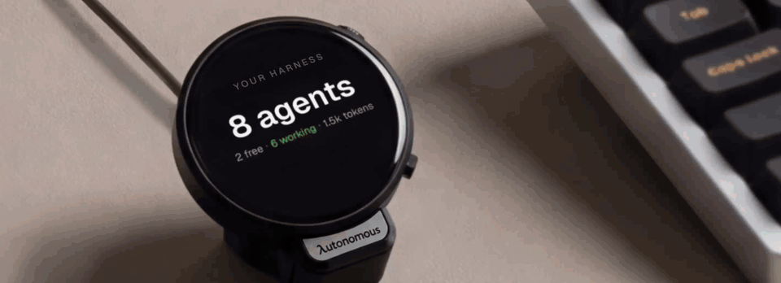</p>

The optional **Harness device** is a round, always-on display that sits beside
your keyboard and shows your agents at a glance: what each one is doing, which one has finished, and
which one is waiting on you. Read a question and answer it on the screen, or tap and speak a new task,
without switching windows.

It is open hardware, all the way down. This repository has everything it takes to build one:

| Layer | What's here |
|---|---|
| [Firmware](devices/harness-device/firmware/) | ESP32-S3, ESP-IDF, a 466 × 466 round AMOLED with touch, microphones and audio. Connects to the host's daemon over USB — no Wi-Fi setup, no account on the device. |
| [PCB](devices/harness-device/hardware/pcb/) | The EasyEDA Pro project, the schematic, Gerbers, the bill of materials, and pick-and-place data for assembly. |
| [Enclosure](devices/harness-device/hardware/3d/) | STEP for editing and STL for printing: the housing, an iron counterweight base, the USB clamp, and the button. |

[**Get a Harness device**](https://www.autonomous.ai/harness), or build your own from these files. The
[firmware guide](devices/harness-device/firmware/README.md) lists the supported boards and build
commands, and the [hardware guide](devices/harness-device/hardware/README.md) covers the design files.

## Contribute

Make a harness for a tool you love. Improve terminals, engines, the daemon or the relay. Port the
firmware. Start with the [contribution guide](CONTRIBUTING.md).

[Development](docs/development.md) · [Extending](docs/extending.md) · [CLI](docs/cli.md) ·
[Security](SECURITY.md) · [MIT license](LICENSE); upstream tools keep their own.
