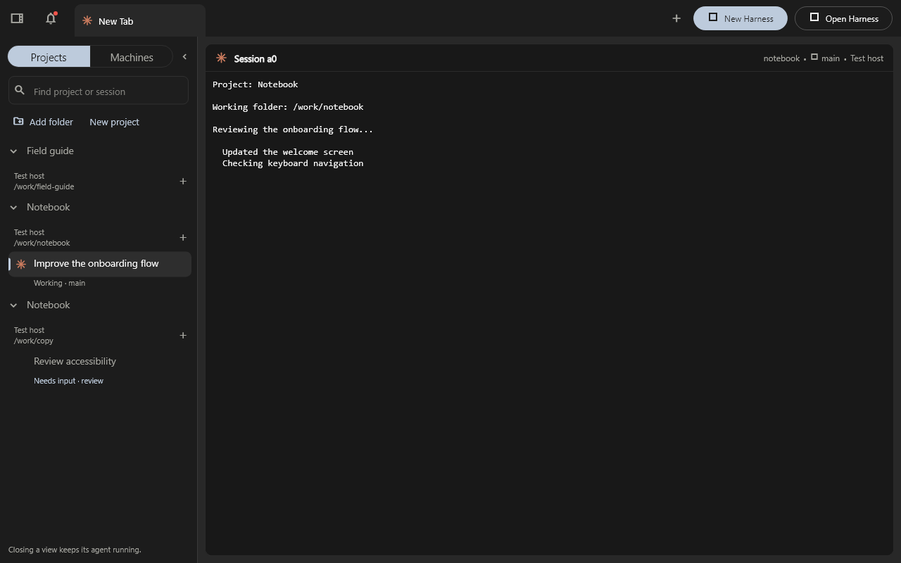
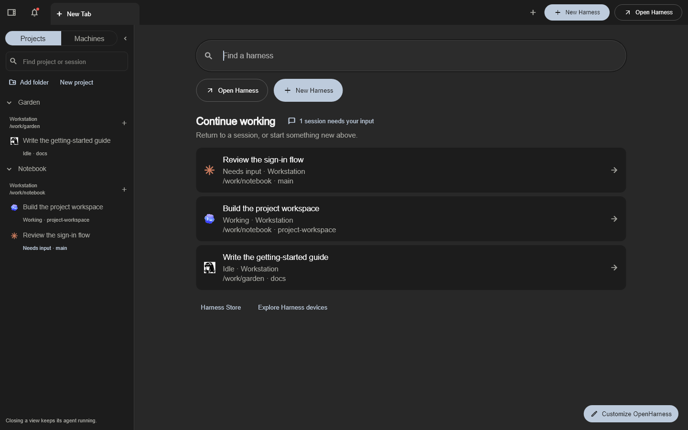

# OpenHarness for Windows 11 — community preview

This is an independent, MIT-licensed fork of Autonomous's OpenHarness. It is not an
official Autonomous Windows release. The native Windows interface uses a Linux
CLI and tmux inside WSL2. Your coding agents still require their own accounts.

## Download and start

1. Download the Windows x64 ZIP and its `.sha256` file from
   [this fork's releases](https://github.com/mcs-eng/autonomous-harness/releases).
2. Extract the entire ZIP to a permanent local folder. Keep `Release/harness.exe`,
   `data`, the DLLs, and `harness-cli` together. Do not run it inside the ZIP.
3. Open `Release/harness.exe`. The preview is unsigned; Windows may warn about an
   unknown publisher. Review the source and checksum before deciding to run it.
4. Follow the setup screen. Without a saved sign-in, Harness opens on this
   computer in [local mode](#local-mode-no-account). To reach your other
   machines, select **Sign in** at the foot of the projects sidebar or in
   **Settings → Account**, and finish in your browser.
5. Create a project and agent. Install and authenticate the coding agent in the
   selected development distribution if its engine is missing. Prefer native Linux
   agent installations; WSL interop discovery is also supported.

To compare the downloaded archive with its checksum in Windows PowerShell:

```powershell
Get-FileHash -Algorithm SHA256 .\harness-desktop-windows-x64-1.0.0-windows.7.zip
Get-Content .\harness-desktop-windows-x64-1.0.0-windows.7.zip.sha256
```

## Projects sidebar (source builds after Preview 7)

The sidebar lists **Projects**. Its **Machines** button opens upstream's
machine list, where you link, rename, or remove machines. Choose a session to
return to its existing tab, or reopen its view if closed; drag a session onto a
pane to show it there.
Project headings expand the list without starting agents. Non-Git folders work
too; a repository with several checkouts lists each working folder, and each host
when there is more than one.



**Add folder** saves an existing location. **New project** opens the creation
dialog; its folder is created only when you submit. The **+** beside a location
(**New agent here**) opens the New Agent dialog with that exact machine and folder
preselected, in a new tab. Shared or disconnected hosts cannot create agents from
this action.
On Windows with WSL, the folder picker browses the selected distribution.

Rows show branch and current activity, including **Needs input**, **Start failed**,
and **Offline**. Closing a view keeps its agent running; stopping remains a
separate **Stop** action. The sidebar sits beside the workspace in windows at
least 1400 pixels wide; in a narrower window the sidebar button opens it as a
drawer, so two panes keep their full header controls. A narrow pane header uses
upstream's **Pane actions** menu. Tab and Enter operate the navigation controls
without taking terminal input.

Each project's **+** (**New agent here**) sits on its title row when the project
has one location; a project with several checkouts keeps one beside each folder.
Right-click a session, long-press it, or press Menu or Shift+F10 on it (a **...**
button also appears on hover) for **Stop harness…** (**Stop terminal…** for a
plain terminal). It opens the same confirmation as the pane header, and once you
confirm, the session ends and leaves the list; project files and saved history are
kept. Stopped sessions stay in history for resuming and do not return to this
sidebar after a refresh. Sessions on a shared machine are view-only. A project you saved with
**Add folder** or **New project** has a **...** button on its title row, and the same
right-click menu, with **Remove from sidebar**. That forgets only the saved entry:
the folder is untouched, and any sessions in it keep running and stay listed under
the project.

Windows tabs also have a visible **x**. It closes that tab's views while its
harnesses keep running, and the existing reopen action restores the tab. It works
on background tabs without switching away from your current tab. Tab and Enter
can activate the close control; middle-click and remapped shortcuts still work.

Sessions are listed by what they are. A row shows the session's own name or
title, otherwise its harness or engine (**Grid**, **Codex**); the clock-stamped
name Harness invented stays in the tooltip. Two rows with the same label in one
project add the clock (**Codex · 16:20**) or a number. A project whose folder
Harness named itself (`agent-3`, `codex-2026-09-21-16-20`) is headed by its
sessions instead. A folder line appears only when it adds information: not when it
repeats the project heading or is a folder Harness named, and as the whole path
when two locations end in the same folder name. The tooltip always has the full
path. **Continue working** uses the same labels and shows the last folder part.
An idle session reads **Ready**, here and in search; a harness session whose
engine exited reads **Stopped**, and its pane says how to start the engine again.
Tabs, pane titles, and the rename, delete, and fork dialogs keep upstream's names,
so a rename starts from the session's real name.

These fork changes touch upstream files: the engine-exit message in
`cli/src/lib/engineLaunch.ts`, **Ready** in
`desktop/lib/widgets/swarm_search_preview.dart`, the pane header's omission of a
generated folder in `desktop/lib/widgets/terminal_panel.dart`,
`isGeneratedWorkFolder` in `desktop/lib/core/project_folder.dart`, and
`SwarmProjectStore.remove` in `desktop/lib/state/swarm_catalog.dart`, with their
tests.
The labels themselves live in the fork's `desktop/lib/state/project_navigation.dart`.

This source change does not update an installed Preview 7 bundle or desktop shortcut.

### Getting back to work and recovering

An empty tab now shows **Continue working** under the New Tab and New Pane
buttons, with up to three existing sessions,
their machine, folder, branch, and current state. Sessions needing input appear
first; your visits during this app session come next. A **session needs your
input** button opens the existing attention list. Opening a session reuses its
existing view and does
not create, restart, or send instructions to an agent. Search and the Harness
Store remain available. A new installation keeps the introductory start page.



Unavailable project sessions now explain the problem and offer **Refresh status**
or **Show machines**. Agent selection shows installation status even in a narrow
window. Installed does not mean signed in or funded. DeepSeek and ZCode explicitly
open their separate browser/desktop workspaces; a successful handoff closes the
managed-agent draft, while cancellation preserves it.

Startup identifies the sign-in check and offers **Try again** when it cannot read
the saved session, rather than assuming you signed out. A failed local-service
start reconnects through the existing supervisor. Sign-out or window disposal
invalidates pending checks, so late replies cannot restart the service or change
old session views. Windows preflight reuses its verified WSL result for the version
check instead of discovering WSL a second time; rechecks still discover afresh and
validate the packaged CLI. This is not a measured launch-time claim.

These changes improve explicit project and agent choice. They do not automatically
route tasks between providers, share credentials, or add model-server load.

### Recovering an existing Linux installation

If setup suddenly reports a missing CLI after changing Ubuntu's default user,
the existing installation may belong to a different Linux account. In setup,
choose **Change Linux account**, turn off **Use WSL default accounts**, then
select the distribution and enter the account that owns that installation.
The same choice is under **Customize OpenHarness → Terminal**.

Save, close, and reopen OpenHarness. The selected distribution and account are
used together for tool checks, CLI commands, project folders, and machine
identity. Saving never switches an active session. This preference does not
change WSL's default user, copy credentials, or migrate project files. Select
`root` only when deliberately reconnecting to an existing root installation;
agents in that account have administrator access inside the distribution.

An unavailable selected account/distribution is an error, not permission to
switch to another installation. A timed-out or malformed tool check shows
**Not checked** with **Recheck** rather than an install action. A confirmed
missing CLI no longer incorrectly marks an available tmux as missing.

## Prerequisites

Windows 11 x64, virtualization enabled, internet access, and a WSL2 Ubuntu
development distribution are required. If WSL is absent, run this in an elevated
Windows PowerShell and finish Ubuntu's user setup after any requested restart:

```powershell
wsl --install -d Ubuntu
```

Docker Desktop's internal distributions are excluded. Setup installs tmux and the
managed Linux Node runtime through the upstream installer. The app runs the
**matching CLI included in this ZIP**, with its automatic updates disabled; it
does not replace your standalone `harness` launcher. Keep this folder in place
while the app or its agents are running.

## Replacing an older preview

Preview 3 includes the terminal typing fix, repairs Claude installation when
WSL inherits Windows npm without Linux Node, and replaces broken Copilot npm
launchers with a verified native installation. Preview 1 can display agent output
while rejecting keyboard text; replace the complete bundle to receive both fixes.
Preview 4 adds **Open in browser** to viewer panes, including Grid's fleet dashboard.
Preview 5 adds isolated local fleets to compatible agents' model pickers and moves
recurring engine discovery off the daemon's main event loop.
Preview 6 also includes the upstream review's Unicode WSL distribution-name fix.
Preview 7 fixes native Windows project-folder creation and incorporates upstream
`0e00e2bb` (September 19): updated harness identities, viewer changes, and the
Store's listed/unlisted distinction. Withdrawn experimental presets stay hidden;
existing installed workspaces are retained. Jev Sheets and the Isolated Web Viewer
are the new listed packages in the bundled catalog. Their own setup and account
requirements still apply; inclusion in the catalog is not live qualification.
The next preview's CLI also stops showing bash's own `no job control` and `logout`
lines in package doctor and setup output when the daemon runs without a terminal,
as it does under WSL, and a timed-out doctor, setup, or workspace init now ends the
whole script rather than only the command that was running.

Source builds after Preview 7 also incorporate upstream `a0b6d204` (September 21):
the Harness branding, the New Harness box and New Pane entry flow, named
permission modes, the shared desk, and the manual update check. The fork keeps its
Windows and WSL paths, local mode, the projects sidebar, and its hardened reading
of agent arguments. Two fork changes gave way to upstream's own versions: the
compact pane-header menu and its header width rules. Continue working now sits
inside upstream's start page instead of replacing it. The desktop updater stays
off on Windows, local mode does not request the account desk, and the New Harness
box treats agent folders as POSIX paths on a Windows host. When this computer's
CLI runs in WSL, that box now completes folders and finds the home folder through
the daemon, as it does for a remote machine; it no longer reads the Windows disk.
With sessions to show, the start page gives Continue working the height that an
empty page leaves above the search. This source change does not update an
installed Preview 7 bundle.

Source builds after this also incorporate upstream `461ff2bf` (September 23),
190 commits. Upstream now lets the CLI daemon start without an account and opens
a signed-out desktop on this computer's desk. This fork takes both, and calls
that desk local mode; it replaces the fork's own login-screen choice and its
`HARNESS_LOCAL_ONLY` flag. The projects sidebar's **Machines** view gives way to
upstream's machine list, so the machine rail and account footer that upstream
removed are gone here too. The model picker takes upstream's searchable panel;
registered local fleets appear in it as **Local** sections beside the account's
own grid, headed **On your machines** as upstream heads it. The startup screen
takes upstream's terminal-style design and keeps **Try again** when the saved
sign-in cannot be checked.

Close the old Harness window. If a previous Harness daemon is running, stop that
daemon from its WSL distribution (`harness stop`) before opening the new preview.
This stops the connection service; do not kill your tmux sessions or delete
`~/.harness`. Existing authentication and session data stay in the distribution.
Then open the new extracted `Release/harness.exe`, not an old shortcut or an
executable under a build scratch directory.

If your previous panes are absent, choose **Open Harness** and select an existing
agent to attach it to the current tab. Repeat for the remaining agents. The saved
tab arrangement and the agent sessions are separate; creating a new Store workspace
does not reopen an existing one or inherit its fleet configuration.

## Additional agent options in preview 3

Choose these from **New Agent** on this PC:

- **Cline** runs its official CLI in a terminal pane with approval prompts enabled.
  Complete provider setup in Cline. This preview does not provide Harness history,
  turn tracking, grid routing, or automatic session resume for Cline.
- **DeepSeek Harness** opens its official browser workspace. First install
  `@deepseek-ai/dsh@0.1.5-rc.2` in your chosen WSL distribution using
  `npm install -g @deepseek-ai/dsh@0.1.5-rc.2` with Node 22.19+ (22.x) or 24+.
  Then select an existing project folder and **Start and open browser**. Return to
  the same option to reopen the browser or stop the server. Closing Harness stops
  that server and its tool processes.
- **ZCode** opens the [official Windows app](https://zcode.z.ai/en/docs/install),
  installed separately. Select your workspace and provider inside ZCode.

DeepSeek and ZCode run beside Harness; their conversations and approvals remain
in their own applications. They are not Harness task-routing targets.

The September 15 prototype loses WSL command arguments and can show **Bad state:
Sign-in did not complete**. Retrying sign-in in that old executable cannot fix it.

## Grid and other Store viewers

The upstream **Grid** harness (`autonomous/autonomous-grid`) is available from
**Store → Grid → Install/Open**. It uses Codex and the Grid toolchain in your WSL
distribution to inspect connected machines, model placement, and fleet telemetry.
Install and authenticate Codex there before starting the agent.

Current Windows source builds embed Grid and other Store viewers beside their
terminals using Microsoft Edge WebView2. Click inside the page to interact with
it; click a terminal or another app control to return keyboard focus. The pane
header provides **Reload viewer**, **Open viewer in browser**, zoom, and close.
Closing a viewer releases its browser surface and leaves the agent running.
Grid's **Pause motion** and **Rack** view stop the map's animation scheduling;
telemetry continues updating. Hidden pages also stop motion until visible again.

Keep Harness and the workspace running while using the dashboard. Viewer
addresses can change after a restart; the pane follows the current address.
If the embedded browser cannot start, use **Retry** or **Open in browser**.
Windows 11 normally includes the [WebView2 Runtime](https://developer.microsoft.com/microsoft-edge/webview2/);
the app reports when it is missing and does not install it silently. Older
Windows previews and Linux retain the external-browser fallback.

The embedded viewer uses the plugin's own WebView2 user-data folder under your
local app data, separate from your regular browser. Popups and device permissions
(camera, microphone, location, clipboard reads, and notifications) are denied; use
the external browser for pages that need them. Ordinary page navigation and
downloads follow WebView2 behavior; downloads show a notice in the pane. The app
adds no host objects, script injection, or filesystem mapping, listens to no page
messages, and disables no browser security. The Windows plugin is pinned in
`pubspec.lock`; its WebView2/WIL build packages use the public NuGet feed in
`desktop/nuget.config` without changing global NuGet settings.

Connect your own Grid before expecting live fleet data. Installing this package
does not deploy models or enroll your GPU machines automatically.

### Local fleets in the model picker

Preview 5 can register an existing isolated Grid home without changing the default
remote/cloud profile. In the WSL distribution used by Harness, run the bundled CLI
with its managed Node runtime. Replace the release path, profile home, and fleet
name below with your existing configuration:

```sh
# Inside the selected WSL distribution (bash)
node_path="$(cat "$HOME/.harness/runtime/current-node")"
"$node_path" "/mnt/c/path/to/Release/harness-cli/cli.js" grid profile set local-fleet \
  --label "My local fleet" --home "$HOME/.harness/grid-fleet/local" --grid my-fleet
```

The profile home must already exist. Open the model dropdown at the top of a
compatible agent pane and choose the model under that local fleet. Registration
does not install models, start a fleet, or prove an agent can complete a turn.
Local Grid 0.3.47 provides OpenAI-compatible inference, so this preview offers it to
engines such as Codex and OpenCode; Claude Code's remote Grid options are separate.
The daemon resolves endpoints and credentials from registered profiles; the picker
sends the profile's opaque identity, never a caller-supplied endpoint or key.

To reopen a configured fleet dashboard, use **Open Harness** and select its existing
workspace. A newly created Grid workspace may show an empty fleet until connected.
Codex may display its own update prompt in the adjacent terminal; that prompt is
separate from the dashboard and can be skipped to continue with the installed version.

## Local mode (no account)

Without a saved sign-in, Harness opens on this computer's own desk: local mode,
upstream's guest desk. The daemon runs on this computer's own id, never dials the
Harness backend, and lists this computer as its one machine. Everything on this
PC works as it does when signed in: create agents, attach terminals, switch panes.

What needs the account stays off until you sign in: other machines, linking,
shared harnesses, the shared desk, and the signed-in profile. The foot of the
projects sidebar and **Settings → Account** say **Local mode** and offer
**Sign in**; linking another machine asks for the sign-in too. If a sign-in is
cancelled or fails, the sign-in screen offers **Use this computer without an
account** to return to the desk.

**Sign out** in **Settings → Account** runs `harness logout`, which clears this
computer's saved sign-in and restarts a running daemon signed out, for this
computer only. The window stays on the desk in local mode: this computer's tiles
stay, and the other machines' tiles leave. A session that ends while the app is
open does the same and says so. From a WSL terminal, `harness start` without a saved sign-in runs the
same daemon, and `harness status` reads `this computer only (not signed in)`.

## Preview limitations and recovery

- Windows desktop and bundled CLI updates are manual: download a new complete ZIP.
- WSL2 Ubuntu with normal Windows localhost forwarding is the supported setup.
  Other distributions, custom networking and clean-machine configurations require
  further validation. This preview is not a broad Windows compatibility guarantee.
- Keep the terminal focused when typing. If another client owns input, choose
  **Take control**. Some shortcuts still use the Windows/Meta key; Ctrl+Tab and
  Ctrl+Shift+Tab switch panes.
- Use the backend folder browser for Linux projects. Drive conversion assumes
  WSL's normal `/mnt/<drive>` mounts.
- See [agent verification](WINDOWS_AGENT_VERIFICATION.md) for tested versions and
  the distinction between executable startup and authenticated model turns.
- Roll back by closing this preview, stopping its daemon, and opening your previous
  complete bundle. Do not delete authentication, projects, or tmux sessions.

Report a problem at the fork's issue tracker with the preview version,
`source-commit.txt`, Windows/WSL versions, and redacted error text. Do not upload
credentials, authentication files, or unredacted logs.

## September 27 source refresh

This source snapshot incorporates upstream `0a7d3cd` and fork main `7362790`.
The updated model and machine controls retain Windows local-profile routing:
same-named local and remote models remain separate choices in pane pickers and
model search. Resting remote grids keep their last observation without automatic
wake requests; background model-list pushes reuse the last local-profile list.
New Harness preserves the selected local profile through creation and retries,
including when another profile or remote grid serves the same model name.
Local profile labels and IDs appear in model search and the new-session picker.
An unavailable profile or incompatible agent is refused without switching routes;
local profile entries do not gain managed-machine controls.
Workspaces use one model selector for the focused pane and keep each pane's hover
close control. Standalone compact terminals retain their own model selector. The
projects sidebar and Continue working list remain available.

Named projects and Git worktrees use the existing Windows exclusive directory
reservation instead of requiring a `mkdir` executable. Files explicitly selected
by `.worktreeinclude` copy with native file operations on Windows. These are
source compatibility changes; they do not update an installed desktop or daemon.

## September 28 source refresh

This source snapshot incorporates upstream `805d3deb` (223 commits since
`0a7d3cd`) and fork main `bc3efc8`. Upstream retired its Herdr terminal backend;
tmux inside WSL remains the only backend here. Upstream split several desktop
files into native and web variants; the fork's Windows fixes moved with them,
including reading the OpenCode usage folder when Windows reports it missing and
refusing a damaged saved WSL account choice on load; only an explicit Save
replaces it, and the damaged file is kept.
Upstream's compact pane header now applies only inside workspaces, where the
focused pane's model is chosen with the single workspace model selector; a
compact header never shows its own. This supersedes the September 27 note about
standalone compact terminals.
The Windows and WSL paths, local mode, the projects sidebar, and the account
screen remain. This is a source change; it does not update an installed desktop
or daemon.

## September 29 source refresh

This source snapshot incorporates upstream `249e0f9` (73 commits since `805d3deb`)
and fork main `b4b3b1f`. Upstream's project names taken from the first task,
per-computer tab profiles (Settings ▸ Profiles), light mode and terminal
hyperlinks arrive unchanged. The viewer fallback keeps the fork's checked address
and failure message and opens the page through upstream's launcher, which is
unchanged on native Windows. The daemon supervisor now respawns the local daemon
without waiting on the sign-in check, as upstream does. Some of upstream's new
desktop tests assume macOS or Linux fonts and colours; those that fail on Windows
also fail on plain upstream and are listed in the pull request. This is a source
change; it does not update an installed desktop or daemon.

New Harness accepts a first task for Hermes, matching the CLI's existing support.
Windows validation now keeps its rules-file fixture in a disposable home
directory and checks the complete appearance settings batch, including the
custom-background key.

The tab strip now reserves a complete tab before sizing the Store label at narrow
widths. Shared-view actions wrap when needed, and short welcome pages reduce
empty space above search before compressing its results. Windows test fixtures
follow the current palette, chrome, keyboard, and workspace-layout contracts;
clipboard delivery and unreachable-update checks use explicit test boundaries.

## September 29 upstream follow-up

This source snapshot incorporates upstream `7debeb17` (nine commits after
`249e0f9a`). It takes the TUI's pane focus, filled surfaces, narrow headings and
layout checks, the local-model catalog's machine budget and candidate ranking,
and the device's Focus and question presentation updates. The prior fork-only
TUI title assertions give way to upstream's explicit pane creation and focus
checks. The Windows application code and tests are unchanged by this sync.

The inherited release workflows remain outside the Windows packaging path.
Source integration does not replace an installed desktop or restart its daemon.

## September 30 terminal copy

In a terminal pane on Windows, Ctrl+C now copies while output is selected and
interrupts the agent only when nothing is selected, as Windows Terminal does. The
copy clears the selection, so a second Ctrl+C is the interrupt. Ctrl+Shift+C,
right-click, and Ctrl+V are unchanged, and macOS and Linux keep their existing
copy chords. The shortcuts list shows the Windows chords. This is a source
change; it does not update an installed desktop or daemon.

## September 30 test stability

The connection tests in `ws_conn_test.dart` now wait for the connection they
depend on instead of a fixed interval. They passed on an idle machine and failed
in a full run on a busy one. The application code is unchanged, and so are the
outcomes the tests check. This is a test change; it does not update an installed
desktop or daemon.

## October 2 upkeep documentation

The [fork upkeep guide](../docs/fork-upkeep.md) records how to compare immutable
fork/upstream revisions, preserve Windows customizations, and distinguish source,
package and runtime evidence. The older September 28/29 Windows failure notes
are historical: [PR #32](https://github.com/mcs-eng/autonomous-harness/pull/32)
records 4,533 desktop passes, 42 existing skips and zero failures on its tested
tree. Later terminal-copy and connection-test changes have their own evidence.
The development guide now describes the existing account-free local mode and
its regression tests. These documentation changes do not replace a Windows
bundle or establish real-account activation.

## October 2 daemon attach recovery

The CLI now retains an attach's original session key when the registry unbinds
that session while its history is being read. Cleanup removes the completed
attach, so a later reset can proceed instead of spinning on a settled promise
and leaving the daemon unresponsive. This backports
[upstream #586](https://github.com/autonomous-ai/openharness/pull/586).
The regression test clears the session ID during an attach and verifies both
cleanup and a subsequent reset. This source fix needs a matching Windows bundle
before it affects an installed desktop's WSL daemon.

## October 2 deterministic project-ordering check

The CLI project-list regression uses explicit timestamps and checks that activity
moves an older project to the top. This removes a same-millisecond test ambiguity;
production ordering and the Windows preview are unchanged.

The Command Code model-level check also waits for its asynchronous refresh result,
instead of assuming that a config read finishes within 20 milliseconds.

## October 2 recap answer selection

Turn recaps now use the assistant's answer after its last tool call, so a long
working turn shows what was found instead of its opening narration. A turn that
ends on a tool call or is interrupted still falls back to its narration. This
backports [upstream 03115e897](https://github.com/autonomous-ai/openharness/commit/03115e897f57b1bd04cccbccc06261bde25b7c9b),
including its three regression tests. This source change does not update an
installed Windows bundle or activate a daemon.

## October 2 terminal question parsing

Question parsing backports [upstream #568](https://github.com/autonomous-ai/openharness/pull/568)
to avoid repeated whitespace matching on padded terminal rows. Regression fixtures
cover labels, checked choices, frame borders and stable request IDs. The change is
limited to parsing; the fork's question polling and session lifecycle stay intact.
A matching Windows bundle is still needed before an installed preview uses it.

## October 2 Windows terminal test fixtures

Fresh Windows checkouts retain the recorded question and permission captures with
LF line endings. Converting those fixtures to CRLF prevented the cursor-movement
simulation from finding rows and caused 23 existing checks to fail. The Git rule
preserves the recorded bytes; it does not change live terminal handling.

LF is also retained for the cable vectors, pinned shared-core source, CLI startup
source and two Store tooling modules. This prevents Windows checkout conversion
from breaking byte checks, startup-source checks or script loading. Their committed
contents and runtime logic are unchanged.

## October 3 bundled Model Manager repair

Windows source builds now embed Model Manager with portable file paths, LF text,
and executable scripts. Previously a Windows-built CLI could report the bundled
package installed while its Linux/WSL directory lacked the expected nested files
and its scripts could not run. The repair is in the CLI build helper; it does not
change the runtime installer or replace an installed Windows preview. A matching
new bundle is required to receive it.

The local-daemon transport tests also use Windows' temporary directory on that
platform instead of assuming `/tmp`. All nine socket and TCP assertions still
run; no test is skipped and no production transport behavior changes.

## October 10 upstream sync seams

Upstream now fills in a restarted or moved agent's grid in the models service
(`core/agents/gridAssignments.ts`) instead of in the core. The fork's local Grid
profiles ride that path: a `local:` launch carries `trustedBaseUrl`, which the
wire accepts only as an http(s) address of at most 2,048 characters, so the
assignment is recognised without asking the cloud grid. Upstream's golden
fixtures that walk every engine read `cli/src/testing/upstreamEngines.ts`,
which leaves out Cline, so those fixtures stay identical to upstream's. Cline
itself is unchanged.

Three of upstream's launch goldens (`launch-argv`, `launch-shapes` and
`dsh-launch-shapes` under `cli/src/engines/__fixtures__`) are re-recorded on
Linux for the fork. The fork's launch scripts differ in three intended ways: an
existing engine must pass its probe before it is used (a Windows npm shim
inside WSL does not), Copilot installs with its own installer, and a Store
package names Cline among the engines it supports. `launch-argv` keeps
upstream's override records, whose former call order its spec pins on purpose.
`discovery.golden.fork.json` lays the fork's quoted-resume reading over
upstream's discovery record instead. When a later sync changes these fixtures,
record them again on Linux (`RECORD_LAUNCH_GOLDEN=1`,
`RECORD_LAUNCH_SHAPES_GOLDEN=1`, `RECORD_DSH_LAUNCH_SHAPES_GOLDEN=1`); a
Windows recording writes Windows paths into them.

## October 10 CI flake fixes

The website check's Install-link lookup reads upstream's releases from the GitHub
API. Unauthenticated, shared CI runners hit its rate limit and the check failed
with 503. The check now passes its job token as `OS_RELEASE_LOOKUP_TOKEN`, a
dedicated name, so a token in a developer's shell is never picked up. A failed
lookup is logged, and the step prints the server log when it fails. The CI gate
job also receives the plan without its per-path lists, so a sync-sized pull
request no longer stops it with "Argument list too long". Product behavior and
the Windows preview are unchanged.

## Disposable WSL smoke admission

A smoke supervisor can opt in to an explicit fixture contract by setting all four
Windows-process variables below. Paths are absolute Linux paths; the guard must
be on the persistent Windows volume, outside the disposable Linux home.

| Variable | Value |
| --- | --- |
| `HARNESS_SMOKE_GUARD` | Reviewed guard script under `/mnt/c/` |
| `HARNESS_SMOKE_HOME` | Private `hwp-gui-*/home` fixture directory |
| `HARNESS_SMOKE_ID` | The fixture's 32-character hexadecimal identity |
| `HARNESS_SMOKE_GUARD_SHA256` | SHA-256 of the reviewed guard script |

Partial or invalid declarations refuse WSL commands: the CLI probe reports the
invalid contract and nothing runs in WSL, while the app still opens on every
platform. Every WSL command through `WslRuntime` then
explicitly checks and sources the guard before executing its original arguments.
A missing wrapper or fixture exits 125, and so does a guard that calls `exit` while it
is sourced. A guard can still end the shell with status 0 before the command runs (for
example with `exec`, or by clearing the EXIT trap first), so admission trusts the guard
only because `HARNESS_SMOKE_GUARD_SHA256` pins its reviewed bytes. Smoke scripts
skip login startup files; ordinary invocation is unchanged when none of the four
variables is present. `BASH_ENV` alone is not an isolation contract.

The guard must verify every declared private state directory and export
`HARNESS_SMOKE_VALIDATED_ID` only after successful validation. The supervisor must
pin the reviewed wrapper for the child lifetime, provide private Windows profile
directories, and retain evidence. This admission check is not a sandbox or a
guarantee about a running child's later filesystem or network activity. Synthetic
guard checks do not qualify a GUI build or authorize an application launch.

The live WSL argv test is opt-in: it additionally requires
`HARNESS_TEST_WSL_ARGV=1`, `HARNESS_TEST_WSL_DISTRO` and `HARNESS_TEST_WSL_USER`.
Without that explicit fixture contract it reports a skip, so the ordinary desktop
suite never probes the default account's login shell. Missing WSL or an unavailable
selected distro also reports a skip rather than a pass that exercised nothing.
The unit tests that pin the ordinary `bash -lc` command line pass an empty
contract, so the rest of the desktop suite gives the same result whether or not
the four smoke variables are exported in the shell that runs it. The live test
still covers only the wrapped command line; nothing runs the ordinary one
against a real distro.

## Saved API changes before a model launch

When a saved API's URL or key changes before an agent is moved or restarted,
Harness checks the selected model and its context window against that connection
again. An unavailable model or failed lookup refuses the launch before the pane
is changed. A later edit during that lookup applies to the next launch; the
current launch keeps one endpoint, key and model result together. An unchanged
URL and key need no extra lookup.
