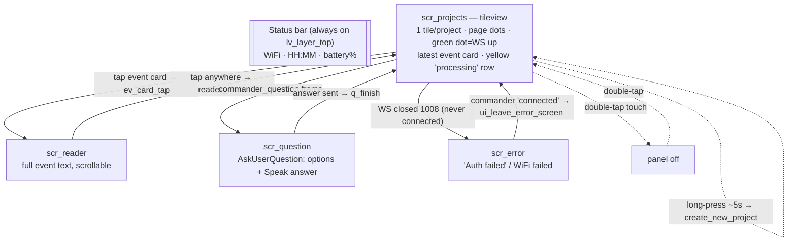
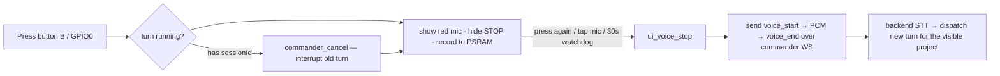
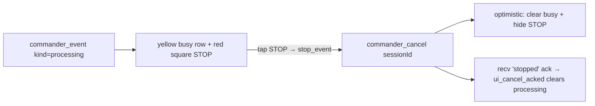
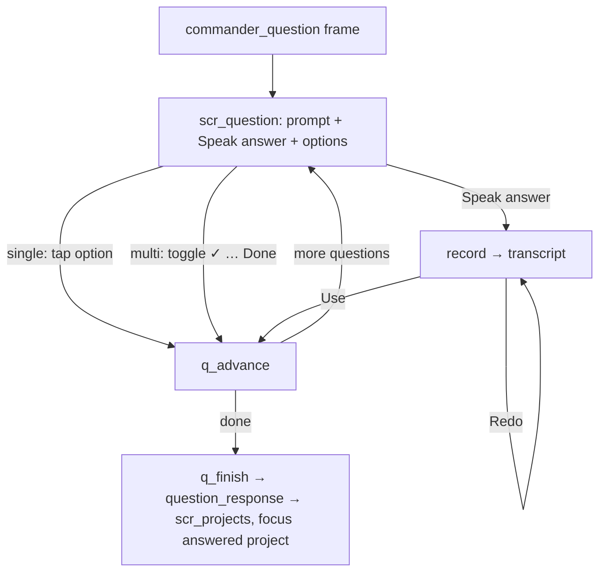

# Interns Commander Device — UI flows & screens

Visual reference for the on-device UI (round 466×466 AMOLED, LVGL v9). Everything here is grounded
in the firmware source — the screens live in `main/ui/ui_screens.c`, the boot/connection state
machine in `main/app_main.c`, touch gestures in `main/ui/touch.c`, and the inbound event handling in
`main/commander_client.c`.

---

## 1. Boot & connection state machine (`app_main.c`)

```mermaid
stateDiagram-v2
    [*] --> Starting: ui_init → scr_connecting "Starting…"
    Starting --> Provisioning: no saved WiFi / force_portal
    Provisioning --> [*]: submit WiFi → save NVS → reboot
    note right of Provisioning
      scr_connecting shows
      "Join WiFi Commander-Setup
       open 192.168.100.1"
      (SoftAP + captive portal, WiFi-only)
    end note

    Starting --> JoiningWiFi: saved networks exist
    JoiningWiFi --> Standby: none in range
    Standby --> Provisioning: long-press (enter_portal → reboot)
    Standby --> JoiningWiFi: retry every ~45s
    JoiningWiFi --> Pairing: connected + no token
    JoiningWiFi --> Linking: connected + token present

    Pairing --> Linking: 6-digit code entered on web (poll → linked)
    note right of Pairing
      scr_pairing: big code + countdown
      api_request_code / api_poll
    end note

    Linking --> Pairing: token rejected (401 / 3 fails)
    Linking --> Projects: agent resolved
    note right of Linking
      scr_connecting "Linking to agent…"
      api_get_agent
    end note

    Projects --> [*]: run loop (commander WS + refresh_task)
    note right of Projects
      refresh_projects → ui_show_projects
      commander_client_start (wss)
      ptt_start, audio_notify_init, OTA check
    end note
```

## 2. Runtime screen navigation — hub is `scr_projects`



## 3. Key interaction flows on `scr_projects`

**Voice (hold-to-talk) + auto-cancel** (`ptt.c` → `ui_voice_start` → `audio_client.c`):



**STOP (interrupt)** — visible only while the shown project is processing:



**AskUserQuestion** (`ui_question_show` → `q_render` / `q_finish`):



---

## 4. Screen mockups (round AMOLED; status bar on top)

### Starting / Linking (`scr_connecting`)
```
             ___________________
          .-'                   '-.
        .'      WiFi 14:23  82%     '.
       /                             \
      /            (  ◜◝  )           \      <- spinner
     |             (  ◟◞  )            |
     |                                 |
     |           Linking to agent…     |
      \                               /
       \                             /
        '.                         .'
          '-.___________________.-'
```

### WiFi setup portal (`ui_show_provisioning`)
```
             ___________________
          .-'                   '-.
        .'     WiFi 14:23   82%     '.
       /                             \
      /           Join WiFi           \
     |         Commander-Setup         |
     |                                 |
     |           then open             |
      \         192.168.100.1         /
       \                             /
        '.                         .'
          '-.___________________.-'
```

### Pairing — 6-digit code (`scr_pairing`)
```
             ___________________
          .-'                   '-.
        .'     WiFi 14:23   82%     '.
       /                             \
      /        Pair on the web        \
     |                                 |
     |          S 8 N 9 R X            |   <- 40px font, letter-spaced
     |                                 |
      \    enter on the web · 4:59    /    <- 5:00 countdown
       \                             /
        '.                         .'
          '-.___________________.-'
```

### Projects — main hub, WS connected (`scr_projects`, MAX_EVENTS=1)
```
             ___________________
          .-'                   '-.
        .'     WiFi 14:23   82%     '.       <- status bar (layer_top)
       /                             \
      /      ● Project 1              \       ● green = commander WS up
     |     ───────────────────        |
     |      ✓ Done: refactored the     |      <- latest event card
     |      auth middleware and…       |         (tap to read full)
      \                              /
       \          • ● •             /          <- page dots (active tile)
        '.                         .'
          '-.___________________.-'
```

### Projects — processing + STOP button
```
             ___________________
          .-'                   '-.
        .'     WiFi 14:23   82%     '.
       /                             \
      /      ● Project 1              \
     |     ───────────────────        |
     |      Summarizing…              |        <- busy row (yellow)
     |                                 |
      \          ┌─────┐             /
       \         │ ███ │  <- red STOP/           tap = cancel/interrupt
        '.       └─────┘           .'
          '-.___________________.-'
```

### Projects — recording voice (hold-to-talk)
```
             ___________________
          .-'                   '-.
        .'     WiFi 14:23   82%     '.
       /                             \
      /      ● Project 1              \
     |     ───────────────────        |
     |      ✓ Done: …                 |
     |                                 |
      \          ( ◉ )              /          <- red mic (recording)
       \          mic                /            press again / tap = stop
        '.                         .'
          '-.___________________.-'
```

### Event reader — full text (tap a card)
```
             ___________________
          .-'                   '-.
        .'                           '.
       /   Refactored the auth        \
      /    middleware to use the       \
     |     new token store, added      |       <- scroll vertically
     |     tests, and fixed the        |          tap = back to projects
     |     race in session cleanup.    |
      \    All 42 tests pass.         /
       \                             /
        '.                         .'
          '-.___________________.-'
```

### Question — AskUserQuestion (`scr_question`)
```
             ___________________
          .-'                   '-.
        .'   Q 1/2                    '.
       /   Which DB should I use?      \
      /   ┌─────────────────────┐      \
     |    │    Speak answer     │       |     <- blue button (voice)
     |    ├─────────────────────┤       |
     |    │  Postgres           │       |     <- option (tap to pick)
      \   ├─────────────────────┤      /
       \  │  SQLite             │     /
        '.└─────────────────────┘   .'
          '-.___________________.-'
```
Multi-select: each option shows a `✓` when selected, plus a `✓ Done — Send` button at the bottom.

### Error (`scr_error`)
```
             ___________________
          .-'                   '-.
        .'     WiFi 14:23   82%     '.
       /                             \
      /         ⚠  Error             \
     |                                 |
     |      Auth failed — Server       |     <- red
     |      rejected the API key.      |
      \     Re-pair with the          /
       \    correct key.             /
        '.                         .'
          '-.___________________.-'
```

### Standby — no WiFi (`app_main` cool standby)
```
             ___________________
          .-'                   '-.
        .'     WiFi 14:23   82%     '.       <- WiFi dimmed (offline)
       /                             \
      /                               \
     |       No WiFi found             |
     |   Connect to a new network      |
     |       [ Setup WiFi ]            |     <- tap → portal
     |                                 |
      \                              /
       \                             /
        '.                         .'
          '-.___________________.-'
```

---

## 5. Screen index (`ui_screens.c`)

| Screen | Shown by | Content |
|--------|----------|---------|
| `scr_connecting` | `ui_show_connecting` / `ui_show_provisioning` | spinner + text (starting / joining WiFi / linking / portal instructions) |
| `scr_pairing` | `ui_show_pairing` | 6-digit code + countdown |
| `scr_projects` | `ui_show_projects` | project tileview (main hub) |
| `scr_reader` | tap an event card | one event's full text, vertical scroll |
| `scr_question` | `ui_question_show` | answer the agent's AskUserQuestion |
| `scr_error` | `ui_show_error` | auth / WiFi failure |
| status bar | `lv_layer_top` (always) | WiFi · HH:MM · battery%, overlaid on every awake screen |

**Global gestures (any screen):** double-tap = toggle panel on/off (auto-sleep after 2 min idle) ·
long-press ~5s on projects = create a new Project · hold **BOOT** at power-on = factory reset →
portal. Button B (GPIO0) = hold-to-talk voice.
