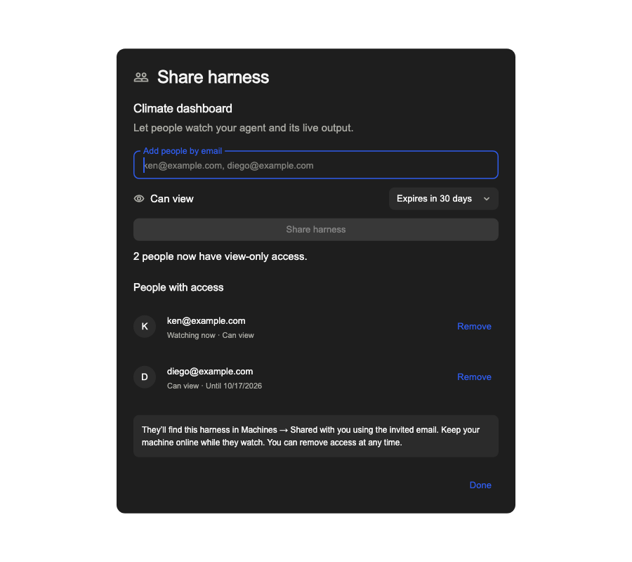

# Share a harness

Status: implemented and pushed in `codex/share-harness`; verified locally on 2026-09-18.

## Experience

The agent pane offers **Share harness**. Its owner enters one or more email addresses and grants
**Can view** access. The dialog lists recipients, expiry, and active observers and supports removal.
Invitations are account-bound and appear in the recipient's app, including after first sign-in.
The app discovers invitations every 15 seconds. The dialog supports 7-, 30- and 90-day invitations,
normalizes and deduplicates addresses, reports pending or failed synchronization, and shows who is
watching. This version grants access inside Harness; it does not send invitation emails.

Machines has **Your machines** and **Shared with you** sections. Shared machines carry an owner label
and a distinct icon. Their submenus contain only harnesses shared with the signed-in recipient.
Opening one shows a live terminal and viewer with a persistent **View only** indicator. Disconnects
preserve the pane and recover automatically. Revocation immediately ends access.
Wide panes show terminal and viewer side by side; narrow panes offer Terminal and Viewer tabs.
The owner keeps terminal control and dimensions while observers join and leave.



## Boundaries

- Authorization belongs to a recipient and a specific agent on a machine. New agents never inherit it.
- An observer cannot acquire a terminal control lease, resize the owner's terminal, send input,
  answer questions or approvals, read arbitrary files, enumerate the machine, or mutate its viewer.
- Observer traffic uses a separate, account-authenticated relay and per-connection encryption.
  Observers never receive a machine's group key or its full-trust pairing credentials.
- The owner daemon keeps its own durable grant allow-list. Backend metadata alone cannot grant access.
- Live viewer images are rendered on the owner's machine. The observer gets pixels, never a proxy
  to a local viewer's APIs. Renderers use a separate browser profile without the owner's credentials.
- Shared machines cannot enter the desktop's general machine connection path. Model discovery,
  new-harness creation and management controls use owned machines only.
- Publishing results and collaborative input are separate future work.

## Verification

Verified invite validation, owner/recipient authorization, duplicate and pending invitations, discovery
filtering, simultaneous observers, encryption and replay rejection, denied input/resize/file access,
revocation, expiry, reconnect, offline state, terminal fidelity, viewer updates and owner controls.
Test identities, daemons and runtime data were isolated from existing sessions.

| Check | Result |
| --- | --- |
| CLI sharing modules | 35 tests pass; 100% statements (466), branches (285), functions (102), lines (306) |
| Backend sharing routes and observer socket | 17 tests pass; 100% statements (141), branches (84), functions (35), lines (99) |
| Sharing UI and affected desktop regressions | 76 tests pass across 10 files, including real loopback WebSockets |
| CLI terminal, tmux, local WebSocket, backend socket and encryption regressions | 237 tests pass across 15 files |
| Share dialog line coverage | 164/164 (100%) |
| Observer pane line coverage | 161/166 (97%); remaining lines are fallback transport callbacks |
| Full backend suite | 440 pass, 11 optional tests skipped |
| TypeScript type checks | CLI and backend pass |
| Desktop analysis | No issues in the 17 analyzed implementation/test targets |
| macOS app | Debug build succeeds using Flutter 3.47.2 with Swift Package Manager |
| Real stack | Passes with production backend, three daemons, MongoDB, Redis, tmux and Chrome |

The 100% thresholds apply to the named sharing modules, not the entire repository or all changed
integration code. `npm run test:sharing` in `cli` and `backend` enforces all four thresholds.

The pre-PR rerun on 2026-09-18 reconfirmed both sharing coverage gates, the full backend suite,
237 CLI regressions, 76 desktop tests, both TypeScript checks, desktop analysis, the macOS build and
the complete real-stack flow. No product changes were needed after that round.

The complete CLI run had 2,959 passes, 52 skips and 6 failures. Two login timeouts and three offline-hook
failures reproduce on the untouched base commit `e077d176`; the sixth (Grok offline registry) passes
when rerun in isolation. The complete desktop run had 1,941 passes, 2 skips and 6 failures: five
sharing-related discovery/header expectations were corrected and pass in the final targeted run.
The remaining terminal-input batching failure also reproduces on `e077d176`. These baseline failures
remain; the repository-wide suites are not claimed green.

Reproduce desktop verification from `desktop`:

```sh
flutter test --no-pub --coverage test/share_harness_test.dart test/shared_harness_panel_test.dart test/api_client_test.dart test/machines_menu_test.dart test/profile_startup_test.dart test/pane_machine_unknown_test.dart test/terminal_panel_presentation_test.dart test/swarm_interactions_test.dart test/ws_conn_test.dart test/ws_readiness_test.dart
FLUTTER_SWIFT_PACKAGE_MANAGER=true DEVELOPER_DIR=/Applications/Xcode.app/Contents/Developer flutter build macos --debug --no-pub
```

Set `HARNESS_SHARE_SCREENSHOT=/tmp/sharing.png` when running the dialog test to export its rendered
invitation state. The dialog was visually reviewed with the app's real fonts.

### Real stack verification

`cli/scripts/share-harness-e2e.ts` runs the production backend and three production daemons against
disposable MongoDB (replica set) and Redis, with independent fixture accounts and tmux sockets.
Only the identity provider and model process are deterministic fixtures. Chrome renders an actual
live viewer. The test checks invitation discovery, two viewers, unchanged owner terminal dimensions,
blocked input/resize/deletion, changing viewer pixels, reconnect, immediate revocation, offline
discovery, and durable permissions after restarting the owner daemon.

Run from `cli` with `HARNESS_SHARE_E2E_SERVICES=/path/to/services.json npm run test:sharing-e2e`.
The JSON contains `mongo` and `redis` URLs for **disposable loopback services**; the test creates a unique
Mongo database and isolates every daemon, identity, project, browser profile and terminal.
Set `HARNESS_SHARE_KEEP=1` to retain logs on success. Failure logs are always retained.

This flow passed locally with MongoDB 7.0.15, Redis 7.4.0, tmux and Chrome, including a final run on
2026-09-18. Disposable services were stopped after verification.

## Runtime requirements

Ship the backend, CLI and desktop changes together. The existing backend startup schema step creates
the new MongoDB collection and indexes; the new Prisma client must be generated during the build.
An older daemon or backend returns an actionable update message in the sharing dialog.

Terminal observation requires the owner's daemon to be online. Live viewer images additionally need
Chrome, Chromium or Brave on that machine; `HARNESS_VIEWER_BROWSER` can point to another compatible
executable. Missing browser support is explained in the viewer while terminal observation continues.
The viewer runs in a fresh browser profile, so authenticated pages may show a sign-in screen. Capture
is fixed at 1280×800, updates approximately every 400 ms, and shares one renderer among recipients of
the same harness, with at most eight active harness renderers per owner.
