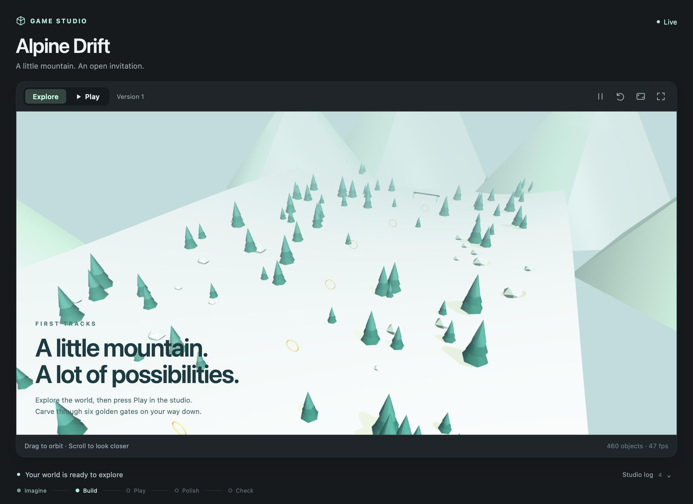

# Remote harness viewers

Status: implemented on `codex/remote-viewers` · validation updated 2026-09-18

A harness on a linked machine opens its viewer beside its terminal in the desktop app. Both
machines need the forwarding-capable CLI. No public listener, inbound port, SSH tunnel, or relay
deployment is required. This uses the existing trusted machine link and preserves the owner's
interactive viewer access. Public watch links and collaborator permissions remain separate work.

## Connection

1. The remote daemon owns the viewer process and its allocated loopback port. It advertises
   `viewerForwarding: 1` inside the authenticated E2EE welcome.
2. The desktop's CLI rewrites viewer URLs in agent lists, creation/restart replies, and agent
   updates. Each remote agent gets a distinct local HTTP origin. Public HTTP(S) viewer URLs keep
   their existing behavior.
3. A short-lived bootstrap URL sets an HttpOnly, SameSite cookie and redirects to the viewer's
   original path, query and fragment. Root-relative assets and WebSocket URLs keep working.
4. HTTP requests, response metadata and streaming bytes travel as pairwise encrypted `viewer_*`
   frames on the existing WebSocket relay. Terminal WebRTC negotiation stays independent.
5. The remote endpoint resolves the agent through the viewer manager. It accepts only a currently
   running HTTP loopback viewer on the port the manager allocated. Requests cannot choose another
   host or port. HTTP redirects are returned to the browser, never followed by the daemon.

HTTP bodies stream in both directions, including POST, Range responses and EventSource. WebSocket
upgrades preserve subprotocols and carry their binary byte stream. Request Host, Origin and Referer,
same-origin response redirects, and viewer cookies are translated between the two origins. The
bootstrap cookie and unrelated local cookies never leave the desktop's computer.

## Bounds and cleanup

- 32 KiB data frames with a 128 KiB credit window per direction. A stalled consumer applies
  backpressure; files are not loaded into memory in full.
- At most 64 active streams per client, 256 per remote daemon, and 64 local viewer gateways per
  machine connection. Requests awaiting response headers or transfer credit time out after 30 seconds.
- Only authenticated web-role sessions or trusted local CLI clients can request a forward.
  Plaintext viewer replies and group-encrypted viewer replies are rejected by the desktop's relay.
- The gateway checks Host, Origin, Referer and fetch metadata, and requires its own bootstrap cookie.
  Viewer cookies use a distinct namespace for each gateway, including across loopback ports.
- Stopping/restarting the viewer process, disconnecting/deselecting a machine, or revoking/evicting its E2EE
  session closes the associated forwarding resources. Detach does this immediately, even while the
  existing terminal relay connection lingers for reconnect. Artifact changes reuse the local origin.
- Restarting only the model/agent process keeps its healthy viewer running, matching local behavior.
- Older remote CLIs produce a viewer pane with update guidance. Local bind failures produce a
  recoverable viewer error while still returning the agent RPC.

## Compatibility and validation

Embedded viewers retain the desktop's macOS requirement. Mobile and direct-to-relay viewer builds
without a local CLI do not gain this forwarding path. A viewer should use relative URLs or
`location.origin` for assets and sockets; hard-coded remote loopback URLs inside JavaScript, HTML,
CSS or CSP are not rewritten. Forwarded viewers must use HTTP on their managed loopback port.

`cd cli && npm run test:remote-viewers` enforces **100% statements, branches, functions and lines on
each of the three new forwarding modules**. It includes network integration, malicious/malformed
requests, cancellation, resource limits and fault injection. It does not claim 100% coverage of the
entire CLI or desktop application.

The end-to-end test uses a desktop local WebSocket, the production relay pool, real E2EE identities,
the production remote daemon dispatcher, a viewer process launched by `DshViewerManager`, and an
opaque loopback backend fixture. It checks response streaming, ciphertext on the relay, restart,
and trust revocation. Set `HARNESS_VIEWER_BROWSER` to a Chromium executable to also run a fresh browser
profile through bootstrap cookies, root-relative assets, POST, SSE and WebSockets:

```sh
cd cli
HARNESS_VIEWER_BROWSER='/Applications/Google Chrome.app/Contents/MacOS/Google Chrome' npm run test:remote-viewers
```

Coverage reports are in `cli/coverage/remote-viewers/`. Desktop tests in `web_pane_test.dart` cover
update guidance, dismissal, recovery and the existing viewer layout. All fixtures use temporary
identities/workspaces and require no real account or model invocation.

Validation recorded on 2026-09-17:

- 68 feature tests passed with the isolated Chrome browser check enabled.
- Each forwarding module reached 100% statements, branches, functions and lines: 476 statements,
  305 branches, 86 functions and 337 executable lines in total.
- 192 surrounding daemon, local WebSocket, viewer-manager and E2EE regression tests passed.
- 23 desktop agent-model/viewer-pane tests passed; modified Dart files passed analysis.
- CLI type checking and build passed.

The fast suite's backend is an opaque relay fixture. The deployment and physical-host tests below
exercise the repository backend and hosted relay separately. Flutter widget tests verify viewer state
and layout; they do not instantiate native WKWebView.

## Deployment and physical-host validation — 2026-09-18

The original 283 passing tests did **not** include a store viewer across physical machines. Additional
checks were added after reviewing that gap. The coverage percentage above still applies only to the
three forwarding modules; it is not whole-application coverage or a guarantee for every harness.

| Local client | Harness host | Relay | What was exercised |
| --- | --- | --- | --- |
| Intel/x64 Mac, Chrome | Same host, direct viewer URLs | None | Blender, Marp, Manim and Godogen viewer pages and assets |
| Intel/x64 Mac, two independent CLI processes | Same host, disposable workspaces | Two repository backend processes, real MongoDB and Redis | Real password linking; four store viewer commands; interactions; agent restart; backend-process outage/recovery; trust revocation |
| Intel/x64 Mac, Chrome and native WKWebView | Apple Silicon M2/arm64 Mac, separate daemon built from this branch | Hosted encrypted relay | All four store viewers loaded in both browser engines; interactions in Chrome; concurrent terminal traffic; large files and ranges |

The physical run used the existing M2 installation's store packages with new test workspaces and a
separate machine registration, identity, registry, auth directory and tmux socket. Its existing daemon,
projects and trust relationships were not replaced. A third Mac was reachable and inventoried through
Harness, but no viewer test was run there. The physical direction tested was **M2 → Intel Mac**.
Both disposable M2 machine registrations returned HTTP 200 on deletion after their peers stopped.
The test bootstrap harness was deleted and a subsequent agent listing confirmed that both bootstrap
IDs were absent. Logs, screenshots and fixture workspaces were retained for review.

Godogen running on M2, rendered on the Intel Mac by the native WKWebView probe through the hosted
encrypted relay (viewer content only; this is not a capture of the complete Flutter app):



Specific assertions:

- Blender's model viewer rendered a small valid glTF. A 12 MiB + 17 byte transfer matched its SHA-256
  hash, a 1 MiB range returned HTTP 206, and a HEAD request succeeded in the local deployment test.
  Remote terminal input was echoed while the physical-host download was in progress; terminal WebRTC
  negotiated through TURN while viewer requests used the WebSocket relay.
- Marp rendered the starter deck, navigated slides, received a live file edit over SSE in the local
  deployment test, and remained usable after the real agent restart RPC on both topologies.
- Manim's video viewer played and sought within a generated, decodable MP4. The video also played in
  the native WKWebView probe.
- Godogen's real starter project built and became playable. Keyboard input moved its player through
  the forwarded iframe in Chrome; the same viewer reached a playable state in WKWebView.
- The fast encrypted fixture also completed assets, POST, SSE and WebSocket round trips in native
  WKWebView, in addition to Chrome. The 68-test suite remained at 100% on all four coverage metrics.
- Killing a local backend process closed the local gateways; reconnecting restored the viewer.
  The separate local deployment test revoked trust, removed the client's persisted pin, closed the
  gateway, and deleted its test agents.
- Revoking the disposable identity on M2 through its local owner API interrupted an active SSE
  response at the Intel Mac, closed the local gateway and removed the persisted pin. A fresh handshake
  using the revoked identity was refused by the hosted path with `NO_PEER_LINK`.

These are **viewer transport tests**. Model CLIs are deterministic echo fixtures; Blender geometry and
Manim media are generated fixtures, not model-produced work. The physical peer starts with temporary
identity pins; the password-pairing flow is exercised by the full local deployment test. The WebKit
probe uses an actual native WKWebView with the pane's JavaScript/media settings, but it does **not**
launch the complete Flutter desktop app. Mobile, Linux clients, reverse direction, other store
harnesses, and a prolonged network impairment/soak test are not covered by these results.

### Reproduce

`cli/scripts/remote-viewers-stack.ts` owns its processes, databases, identities and tmux sockets. It
requires installed dependencies in `cli`, `backend`, `store/agents/godogen`,
`store/agents/marp/toolchain` and `store/viewers/model-viewer`, plus tmux, ffmpeg and Chrome.
`HARNESS_E2E_SERVICES_DIR` names a separate npm directory containing `mongodb-memory-server` and
`redis-memory-server`; the recorded run used versions 11.2.0 and 0.17.1. Existing binaries can be
selected with `HARNESS_E2E_MONGOD` and `HARNESS_E2E_REDIS_SERVER`.

```sh
cd cli
HARNESS_VIEWER_STACK=1 HARNESS_E2E_SERVICES_DIR=/path/to/test-services \
  node --import tsx scripts/remote-viewers-stack.ts
npx tsc --noEmit -p tsconfig.viewer-tests.json
```

The macOS native probe can be enabled in the fast suite and physical-host runner:

```sh
swiftc -module-cache-path /tmp/viewer-swift-cache scripts/viewer-webkit.swift -o /tmp/viewer-webkit
HARNESS_VIEWER_BROWSER='/Applications/Google Chrome.app/Contents/MacOS/Google Chrome' \
  HARNESS_VIEWER_WEBKIT=/tmp/viewer-webkit npm run test:remote-viewers
```

For an explicitly selected physical host, `remote-viewer-live.ts init <client-dir>` creates a disposable
client key and prints only its public key. On the remote host, `remote-viewer-peer.ts <client-pub>
<new-peer-dir>` starts a separate daemon using its already-installed store packages and already-signed-in
account. Both runners require `HARNESS_VIEWER_LIVE_TEST=1`. Copy only the resulting public
`peer-info.json` back to the client, then run:

```sh
HARNESS_VIEWER_LIVE_TEST=1 HARNESS_VIEWER_WEBKIT=/tmp/viewer-webkit \
  node --import tsx scripts/remote-viewer-live.ts run /path/to/client-dir /path/to/peer-info.json
```

The peer automatically stops after one hour, or when a `stop` file is created in its peer directory.
It removes its test machine registration, terminates its daemon and tmux socket, and removes the copied
auth directory. Logs and fixture workspaces remain for review. The client writes `results.json` and
screenshots to its own directory. `HARNESS_VIEWER_REVOKE_CHECK=1` runs a separate active-stream
revocation check: after `READY_FOR_REVOCATION`, invoke `/api/revoke-all` on **that disposable daemon's
printed loopback port**, then stop the peer. This check writes `results-revocation.json`.
