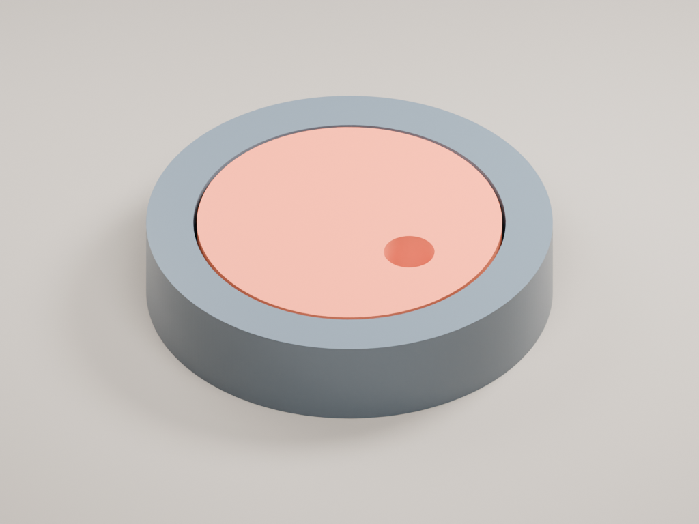

# Orchestrator: morning review

Work is isolated on `codex/orchestrator-workspace` in `/Users/d/code/autonomous-harness-orchestrator`. The shared main checkout, installed app, running daemon, other agent sessions, and account configuration were not replaced.

Update: the [pre-PR verification round](2026-09-18-orchestrator-pr-verification.md) repeats the full suites, native checks, production builds, and a second successful live CAD project, and includes captures of the implemented launcher.

## What you can try

This is built and pushed, **not installed over your running app/daemon**. The normal debug app is at `desktop/build/macos/Build/Products/Debug/Harness.app`. Full production use needs this branch's desktop **and matching CLI**; an older daemon will ask for a CLI update. A deliberate switch can happen when you are ready, without disturbing the other worktrees overnight.

Press **⌘P** in this branch's desktop app to open the large project prompt. **⌘B still routes to a specific agent.** Choose a director, enter the project, and start. The right side stays one conversation; the left gains specialist viewers as the director delegates. Workers use ordinary background tmux agents. Inspect opens their normal agent tabs only when requested. Closing a project tab does not stop its work.

Projects support arbitrary dependency graphs, parallel independent work, fan-in, failed-dependency blocking, explicit retries in fresh folders, and new immutable revision tasks. Downstream workers receive read-only copies of exactly the completed artifact versions, with hashes. A live viewer or an idle agent does not count as success.

## A real project finished

`Solid / Codex → Autonomous Workshop / Codex`, directed by Codex, completed in **515 seconds**. The director chose and submitted the plan through the same local orchestration tools used by the app. No worker output was predetermined.

1. Solid made a 24 mm diameter, 5 mm thick token with a 4 mm off-center through-hole.
2. Workshop imported that exact pinned STEP, made a 32 mm holder with a 24.6 mm recess, and placed the token on its 2 mm base.
3. The director checked the results and explicitly completed the project.

The live run passed seven external transport/artifact checks. Workers reported 34 geometry checks. An additional independent STEP reimport—without executing their Python—passed **12 checks**, including positive volumes, valid solids, 0.3 mm radial clearance, zero overlap, and unchanged upstream-token geometry.



Review the [portable GLB](../../output/orchestrator-live/assembly.glb), [assembly STEP](../../output/orchestrator-live/holder/model.step), [token STEP](../../output/orchestrator-live/token/model.step), and [independent measurements](../../output/orchestrator-live/independent-checks.json). The PNG/GLB above were generated afterward by a deterministic Blender script from the verified CAD; they are **not** evidence of a successful live Blender agent.

The initially attempted Claude → Solid → Blender run stopped before delegation because Claude reported an expired OAuth session it could not refresh ($0 reported model cost). The installed Codex account worked. Remotion is not installed. Neither a live Claude/Blender combination nor a live Remotion movie is claimed as tested.

## Verification and scope

Measured coverage refers to the new orchestrator modules, **not the entire repository or every possible model behavior**:

| Scope | Result |
| --- | --- |
| Six CLI orchestrator modules | 80 tests; **430/430 lines, 568/568 statements, 313/313 branches, 88/88 functions** |
| Three desktop orchestrator modules | 20 tests; **529/529 executable lines** |
| Timing-sensitive install/terminal regressions | 68 tests passed after removing host-scheduling assumptions |
| Complete desktop suite | **1,955 passed, 3 skipped, 0 failed** |
| Complete CLI suite (serial run) | **3,011 passed, 52 skipped, 0 failed** |
| Deterministic socket/tmux/viewer end-to-end | Passed again in 14 seconds |
| Native three-WKWebView integration + normal macOS debug build | Both passed again |
| Native keyboard mapping + complete AppKit titlebar checks | **101 mapping + 464 titlebar checks passed**, including 9 focused-viewer dispatch checks |
| Independent live geometry check | 12/12 passed |

Reproducible gates: `npm run test:orchestrator` in `cli/`; in `desktop/`, `flutter test --coverage test/orchestrator_test.dart test/orchestrator_controls_test.dart` followed by `node tool/check_orchestrator_coverage.mjs`. No feature coverage exclusions were added to achieve these results.

- CLI: real loopback transport, all RPC actions, graph scheduling, immutable artifacts, delivery receipts, concurrent creation, scoped cancellation, restart recovery, storage failures, and fast-worker races. A synthetic **64-task graph across three engines**, limited to six simultaneous workers, verified more than 100 real pinned-file handoffs; it uses fixtures, not 64 paid model agents.
- Desktop: launcher options, ⌘P/⌘B separation, recent projects, chat drafts/focus, reconnect, delayed replies, narrow layout, unsafe URL refusal, viewer zoom, explicit inspection, stop confirmation, and restoration.
- Deterministic end-to-end: actual desktop connection → daemon → dedicated tmux agents → real harness materialization → real HTTP viewers, with a parallel fan-out/join project, restart/reconnect, follow-up chat, and cross-project cancellation isolation.
- Native macOS: debug build and a test with three real WKWebViews whose DOMs were read through JavaScript; chat draft/focus survived viewer updates. Native shortcut tests exercised actual AppKit events from a focused WKWebView descendant, including ⌘P, repeat suppression, remapping/unbinding, modal blocking, and leaving ⌘B alone.
- Live: real model-generated two-harness project, real tmux sessions, real CAD toolchains and viewer servers, pinned artifact handoff, and independent geometry verification.

The live test uses a **bounded headless bridge**, not the production interactive engine TUI. Production input coordination has separate regression tests. Physical keyboard delivery through a focused live production viewer was not manually tested. The live test stopped its own tmux server and viewers and retained its files; other sessions were untouched.

Broad-suite caveats are retained rather than hidden by the coverage percentage: an earlier concurrent CLI run had one relay-handshake fixture failure (`Unexpected server response: 200`), while its isolated 11-test suite and the final complete serial run passed. The broader AppKit titlebar checks exposed stale tab-capacity, terminology, presence, and model-manager caption expectations. Those fixtures were updated to match behavior already present on main, with no unrelated production-menu changes; all 464 native checks now pass. The 55 skipped tests across the two full suites remain skips, not claimed passes.

The Codex test needed command-network access to its loopback daemon. OpenAI Docs guided a **per-process** `sandbox_workspace_write.network_access=true` override while retaining workspace-write and approval review; no global settings were edited. See [official network-access documentation](https://learn.chatgpt.com/docs/agent-approvals-security#network-access).

## What remains worth improving

- Reauthenticate Claude interactively, then rerun `cad-blender`; install/authorize a Remotion harness separately before claiming video support has been live-tested.
- Add an explicit, user-reviewed way to adopt an uncertain launch after a crash. Current behavior refuses blind retries to avoid duplicate agents.
- Keep monitoring large-project state limits and long-history receipt retention. The state reader is bounded to 8 MiB and the visible transcript to 200 messages; those are not unlimited project memory.
- A vanished worker remains inspectable/manual-recovery work; absence or idleness never fabricates a successful result.
- Artifact ownership and read-only copies prevent accidental cross-task edits; they are not a security sandbox against an agent running as the same OS user.
- CAD checks are mathematical only: physical printing, insertion, material behavior, and manufacturing tolerances remain unverified.

For creative project ideas, exact handoff contracts, and honest readiness labels, see the [harness combination cookbook](../orchestrator-combinations.md).

## Reproduce safely

From this worktree's `cli/` directory, `HARNESS_ORCHESTRATOR_LIVE=1 HARNESS_ORCHESTRATOR_LIVE_SCENARIO=cad-fit node --import tsx scripts/orchestrator-live-project.ts` runs the account-backed test. It may consume model credits. Omitting the scenario selects the Claude/Blender test. Limits: six total agents, twelve headless turns, four turns per agent, twelve minutes; Claude print calls additionally have a $1 per-turn limit. Codex account usage is not dollar-capped by this adapter.

The deterministic peer and desktop tests do not use model accounts. Do not replace the running daemon just to inspect this report.

Additional regression commands from this worktree:

```sh
# cli/
npm run typecheck
npm exec vitest run -- --maxWorkers=1 --testTimeout=30000

# desktop/ — use the project's compatible Flutter SDK, not an older global one
flutter test --no-pub --concurrency=2
HARNESS_ORCHESTRATOR_CLI_ROOT=/Users/d/code/autonomous-harness-orchestrator/cli \
  flutter test --no-pub test/orchestrator_local_e2e_test.dart
FLUTTER_SWIFT_PACKAGE_MANAGER=true \
  DEVELOPER_DIR=/Applications/Xcode.app/Contents/Developer \
  flutter test integration_test/orchestrator_native_viewers_test.dart -d macos --no-pub
DEVELOPER_DIR=/Applications/Xcode.app/Contents/Developer \
  bash tool/check_keymap_native.sh /private/tmp/harness-sdk-3.47.2-x64/flutter
```

The native viewer test builds a test-entrypoint app. Follow it with `FLUTTER_SWIFT_PACKAGE_MANAGER=true DEVELOPER_DIR=/Applications/Xcode.app/Contents/Developer flutter build macos --debug --no-pub` to leave a normal app build. That final production-entrypoint build was completed for this handoff.
