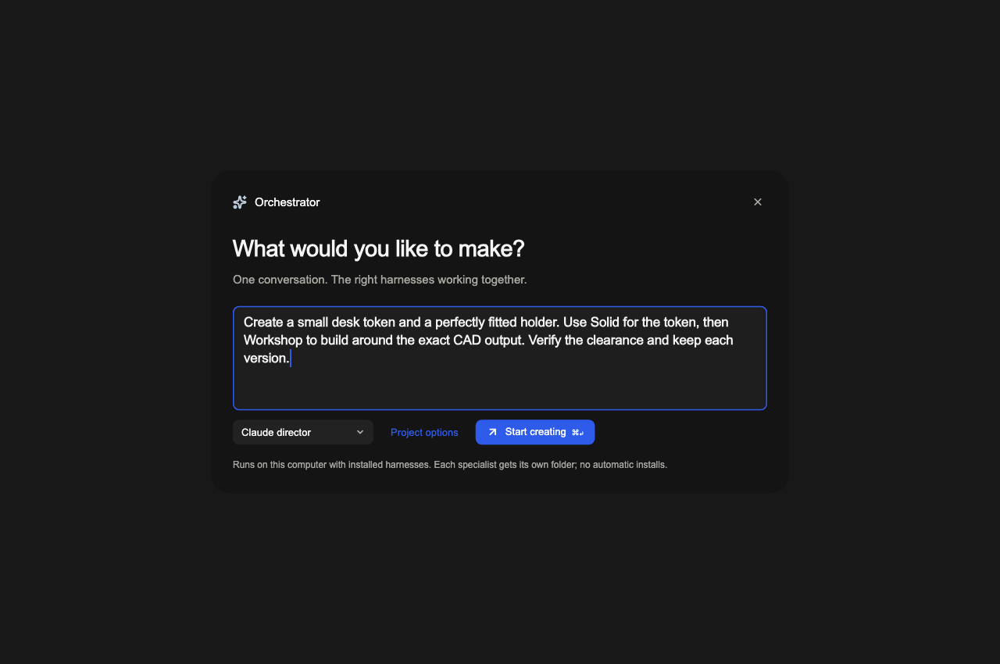

# Orchestrator: pre-PR verification

Repeated on September 18, 2026 in the isolated `codex/orchestrator-workspace` worktree. The production implementation tested is `5ecc8994`; the final checkpoint adds only rendering tests, screenshots, and this verification record. No production fixes were needed in this round. Current `origin/main` was an ancestor of the branch, with no merge conflicts.

## Fresh results

| Check | Result |
| --- | --- |
| Full CLI suite, serial with 30-second per-test deadline | **3,011 passed, 52 skipped, 0 failed** |
| Full desktop suite, concurrency 2 | **1,955 passed, 3 skipped, 0 failed** |
| New launcher rendering checks, run separately | **2 passed**, 1280×850 and 600×700 |
| CLI orchestrator coverage on Node 26.7.0 and managed Node 22.23.2 | **80 tests passed on each**; 430/430 lines, 568/568 statements, 313/313 branches, 88/88 functions |
| Desktop orchestrator coverage | **20 tests passed**; 529/529 lines in the three feature files |
| TypeScript typecheck and targeted Flutter analysis | Passed; no issues |
| CLI development build and release-style bundle | Both passed |
| Bundled CLI under managed Node 22.23.2 | Version, actual loopback catalog RPC, and empty project list passed against a new isolated peer; no agents started |
| Deterministic desktop → daemon → tmux → real viewers E2E | Passed in 14 seconds, including pinned handoffs, reconnect and cancellation isolation |
| Native three-WKWebView integration | Passed, including page DOM inspection and director draft/focus retention |
| Native shortcuts/titlebar | **101 keymap + 464 titlebar checks passed**, including nine focused-viewer shortcut checks |
| Normal-entrypoint macOS debug build | Passed after the integration-test build |
| Second account-backed Solid → Workshop project | **Completed in 479 seconds**; all seven external checks passed |
| Independent CAD reimport | **12/12 passed** for both the original saved artifacts and the second live run |

Host: macOS 26.6.2, x86_64; Flutter 3.47.2 / Dart 3.13.2. The complete CLI suite used Node 26.7.0. The feature suite, typecheck, bundled build, and bundled transport smoke check also ran under the installed production runtime, Node 22.23.2. No Linux or Windows run is claimed.

The 55 skips remain skips. Coverage is scoped to the new orchestrator modules, not the whole repository or arbitrary model behavior. The two screenshot tests were added after the full desktop run started and were separately run and analyzed. Repository CI is intentionally manual; opening the PR does not itself run the GitHub workflow.

## Second real project

Run `b3ecdeec484931b6964a51e872747cb6` used a Codex director and the installed Solid and Autonomous Workshop harnesses. The workers generated new geometry rather than replaying the first run's files. Workshop consumed the exact pinned upstream token.

- Token: 24 mm diameter, 5 mm thick, 4 mm hole offset 6 mm; volume 2199.114857512874 mm³.
- Holder: 32 mm outside diameter, 24.6 mm recess, 2 mm base, 5 mm recess depth.
- Independently reimported assembly: two valid solids, 0.3 mm radial clearance, zero intersection volume, and zero upstream-token symmetric difference after undoing its 2 mm placement.
- Token STEP SHA-256: `462bb1d7554dac272d7daab8d36c080ded5e6d2f93de28e2b1b69f52a2f7acee`.
- Assembly STEP SHA-256: `a934b3bca90da361b3830f47aee10821bd8477acc469af1a7ebc1f1dd869d549`.

Independent validation executes the checked-in verifier, not worker-generated Python. The live harness uses the documented bounded headless adapter rather than the production interactive engine TUI. Its own paid processes, viewers, and tmux server stopped afterward. Existing app/daemon sessions were not replaced. Physical fit and manufacturing readiness remain unverified.

## Implemented launcher, not a mockup

These are programmatic captures of the production Flutter launcher with a read-only local fixture. They do not start agents, read real project history, or claim to show a running CAD viewer. Fonts and icons are loaded explicitly because headless widget tests disable native font fallback. The actual macOS viewers were checked independently by the native integration test above.

[Narrow launcher capture](../../output/orchestrator-review/launcher-dark-600.png).

To regenerate from `desktop/`, set `HARNESS_ORCHESTRATOR_CAPTURE_DIR` to an output directory and run `flutter test --no-pub test/orchestrator_review_render_test.dart`. The test mirrors the app's supported dark-only shell; it does not invent a light-mode product variant.

## Review and remaining boundaries

Use both this branch's desktop and matching CLI to try ⌘P; ⌘B remains unchanged. The debug app and CLI bundle were built, not installed over the running versions. The [morning report](2026-09-18-orchestrator-morning-report.md) contains the architecture, initial live evidence, reproduction commands, and recovery/storage limitations. The [combination cookbook](../orchestrator-combinations.md) distinguishes proven combinations from proposed workflows.

Claude/Blender and Remotion were not revalidated in this round. The earlier Claude run hit expired OAuth credentials, and Remotion was not installed in the validated inventory. Unknown launches, vanished workers, local-only orchestration, finite history/state limits, and same-OS-user artifact isolation retain the documented boundaries; passing tests do not remove those limitations.
