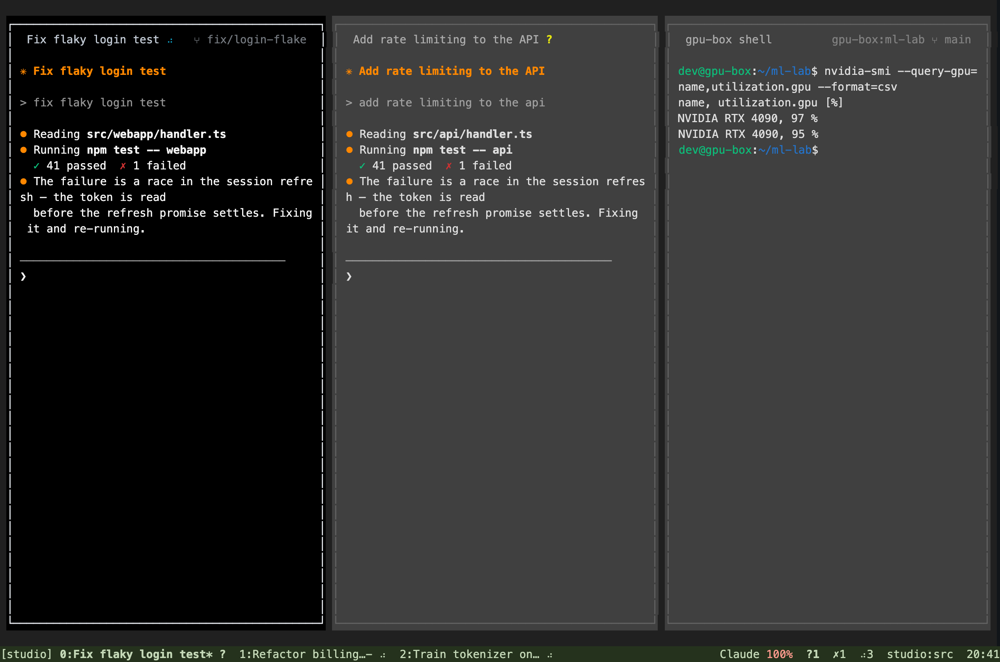
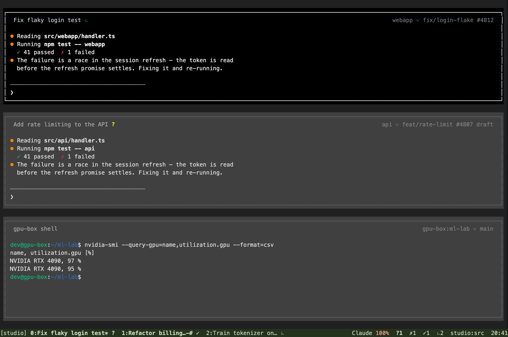
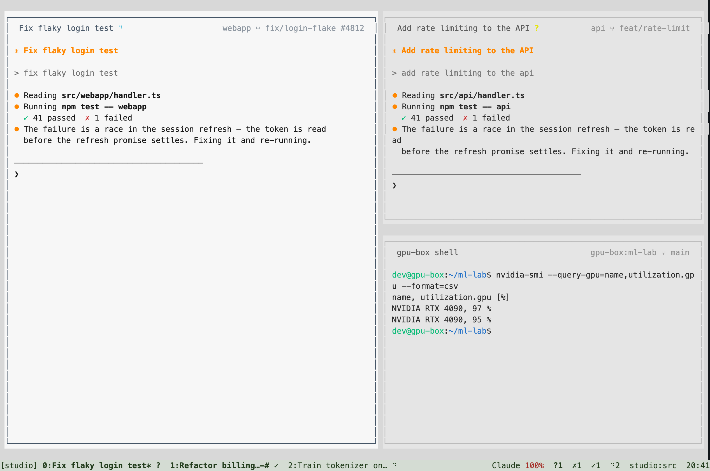

# hn pane surfaces

hn now presents terminal panes as quiet surfaces with space between them. Each pane has
an integrated title, its own outline, and inset content. Focus uses a thin, bright border;
the other outlines stay thin and muted. The status line stays
at the bottom in muted green, with tabs ordered `number:name* status`. Pane headers put the
name before the state too: `hn ⋮` on the left, with `project ⑂ branch #123` aligned to the
right. Long names shorten in the middle so their state and distinguishing suffix remain visible.
Watcher details shorten when needed; raw `pane_title` values stay complete.
Quota text is compact: `Claude 100%`, with amber or red only on the percentage. The branch
appears only in pane headers; the
bottom right keeps the familiar `machine:folder` location cue. Status-bar groups have two spaces
between them. Working and waiting indicators remain visible; idle dots are hidden in tabs and
pane headers. Attention markers, prefix cues, inbox rows, connection notices, preview counters
and marked tree rows use text, symbols and emphasis instead of inverted badges. Cursor and
selection highlights, explicit user styles and program ANSI remain supported. Unread and bell
tabs keep their status symbols with bold text. The status bar has a continuous background;
current `*` and previous-window `-` markers stay directly after the name, before harness status.
Raw tmux format variables keep their flags.
This changes the presentation while preserving tmux keys and split structure.







These images render ANSI cell captures from the real hn binary inside an isolated tmux PTY,
using mock harness output. They are terminal output, not design mockups. The rendering uses
Menlo and a representative ANSI palette; the user's terminal controls its own font and ANSI
colors.

## Geometry and compatibility

The layout tree remains responsible for named layouts, percentages, pane targeting, directional
navigation, resizing, and serialized `window_layout`. Presentation insets are calculated separately
and shared by rendering, cursor placement, PTY sizing, copy mode and application mouse input.
Position targets such as `top-left` and percentage splits use structural dimensions, so changing
the appearance cannot move the split boundaries. The original divider cells are blank gutters
and still support mouse dragging.

At normal sizes there is a one-cell gap around the pane surfaces and between adjacent panes,
one column of content padding on each side, and vertical padding where space permits. Small
panes automatically give these cells back to the program. A one-cell terminal remains responsive
and survives resizing.
The focused pane keeps the terminal's native background and full text contrast throughout
its filled interior and border cells, so there is no canvas-colored strip inside the outline.
The terminal draws the thin line within its character cell; its pane-colored background fills
that whole cell. Other panes use `rgb(64, 64, 64)` surfaces in dark
terminals, with softer text. Each pane owns a complete outline inside its tile; a dark one-cell
gap separates neighboring outlines. All outlines use thin box-drawing characters. The focused outline uses a brighter neutral
color; inactive outlines use a muted gray. Explicit
border styles and line choices override these defaults. The bottom status bar keeps its own
color.

Light terminals retain a light surface counterpart. A lone or zoomed pane uses its own
background throughout, without a focus outline. Focus changes alter border color
without resizing program content or changing its mouse coordinates. Compact panes give border
and padding cells back to the program. Surface colors follow the terminal's native light/dark
theme and update when it changes. The daemon receives those colors so its programs agree with
their surrounding padding. Program ANSI foregrounds, backgrounds and attributes remain intact;
only default colors inherit the pane surface palette. Explicit title formats still override the
default heading. `pane_heading` fits the displayed name, state and watcher label to the title
row; scripts and custom formats can continue using the complete `pane_title`.

The default is `set -g @hn-look panes`. `set -g @hn-look classic` selects the previous hn line
borders. `set -g @hn-look tmux` selects tmux's appearance and unpadded content geometry. Switching applies immediately without recreating panes or changing the layout.

## Verification

The release build passes 150 Rust tests, including rectangle containment and usable minimum
sizes, adjacent surfaces, user style overrides, light/dark contrast, foreground inference and
malformed OSC color replies. The new `tui/tests/pane-ui.py`
exercises the running application with actual keys and SGR mouse input:

- Directional navigation and wrap, zoom/unzoom, copy selection, header focus and gutter dragging.
- All seven layouts and eight position targets with top, bottom and disabled pane titles.
- Identical split structure across appearances, including percentage splits on both axes.
- Application mouse coordinates after padding and after adding two status rows at the top.
- Independent outlines, dark gutters, exact border colors, and focus brightness through keyboard and mouse selection.
- Explicit border colors and line styles, and long titles retaining their suffix and waiting mark.
- Borderless single and zoomed panes, right-aligned branch context, and hidden idle indicators.
- Live light/dark theme changes, custom style overrides in active and inactive panes, and reported option defaults.
- Explicit program foreground/background colors; 80x24, 24x8, 6x4 and 1x1 terminals.

The main e2e suite, layout synchronization suite, local shell lifecycle suite, native terminal
suite, and terminal attribute comparisons against real tmux also passed on macOS. The full
isolated real-stack suite passed all ten checks: real daemon, backend, MongoDB, Redis, tmux and
Chrome, including viewer input, browser reconnect, terminal lease recovery and C-b Space
persistence. OAuth and model execution are fixtures. No production account, live user pane,
installed hn binary or release was changed.

The full-flow test also exposed a delayed picker refresh consuming a subsequently opened
command prompt. Refresh now checks that a picker is still open before taking the modal; a unit
regression preserves prompts, confirmations and copy mode, and e2e waits for the actual status
prompt rather than matching a colon in a pane title.

Linux CI additionally caught percentage sizes being passed through `strftime`, which rejects
a trailing percent sign on musl. Split and join sizes now expand tmux variables without implicit
time formatting, preserving `35%` and `#{client_width}%` across platforms.

Desktop saves can omit hn's exact layout. Previously that field disappearing, an empty size
map, or a preset changed for another pane count could reset the current window. Reconciliation
now checks the layout relevant to the current panes. C-b Space also publishes a matching desktop
preset when available, and queued choices survive incoming replies. A later divider edit cannot
revive an older local preset after a deliberate remote choice. The two-pane regression exercises
actual prefix keys and unequal pane sizes in modern, legacy and read-only desk modes; the real
backend/daemon check also simulates desktop serialization and a deliberate remote layout change.

The new pane test is part of both Linux x86-64 and ARM64 CI jobs. To repeat it locally:

```sh
CARGO_TARGET_DIR=/tmp/hn-pane-target cargo test --manifest-path tui/Cargo.toml --release --offline
CARGO_TARGET_DIR=/tmp/hn-pane-target cargo build --manifest-path tui/Cargo.toml --release --offline
HN_PANE_UI_BINARY=/tmp/hn-pane-target/release/harness-tui \
  HN_PANE_UI_PORT=19783 python3 -u tui/tests/pane-ui.py
```

The test freezes the binary and uses a disposable home, explicit private hn/tmux sockets and
ports guarded to 19783–19789. Its processes are stopped before the test home is removed.
