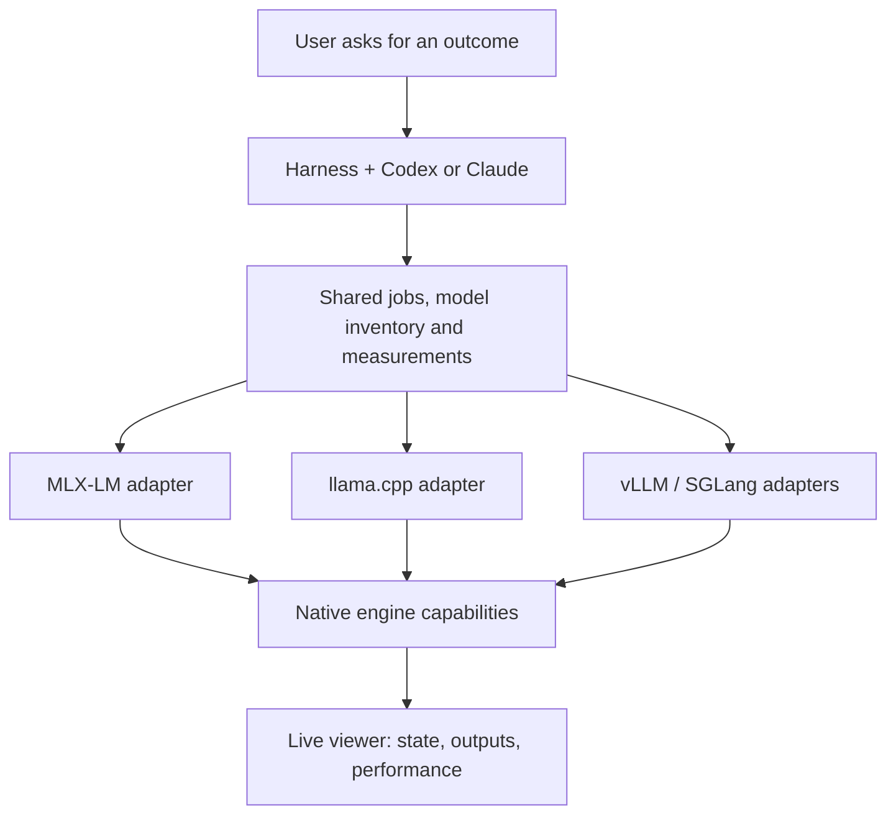

# Product direction: an agent for the engines

Decision updated September 20, 2026 following the user's clarification.

Harness, its conversational agent, and the viewer provide the model-management experience.
The most valuable integrations expose engine capabilities that otherwise require learning
complex commands, settings, deployment procedures, and troubleshooting. The user's analogy
is Blender operated through an AI agent: ask for an outcome and inspect the actual result.

This is the intended architecture. Currently Ollama, MLX-LM and vLLM (Metal backend) adapters are implemented;
llama.cpp and SGLang remain proposed work. Codex is the operator in the current
packages. Its configured provider is separate from the local models it operates.

## Revised priorities

| Priority | Engine / framework | Distinct value to expose through the agent | Status |
| --- | --- | --- | --- |
| 1 | [MLX-LM](https://github.com/ml-explore/mlx-lm) | Direct Apple Silicon execution; eventually quantization, cache/context controls, adapters and tuning | Initial inference harness implemented; advanced controls are future work |
| 2 | [llama.cpp](https://github.com/ggml-org/llama.cpp) | GGUF selection, quantization, Metal offload, context/cache configuration and native serving | Next recommended harness |
| 3 | [vLLM](https://github.com/vllm-project/vllm), using [vLLM Metal](https://github.com/vllm-project/vllm-metal) on this Mac | Scheduling, batching, concurrency, throughput/latency tradeoffs and serving configuration | Initial Mac harness implemented and qualified on Qwen3 0.6B; community-maintained Metal backend |
| 4 | [SGLang](https://github.com/sgl-project/sglang) | Advanced serving, cache reuse and structured workloads | Qualify the MLX backend on M2 Max; do not infer CUDA feature parity |
| Retain | Ollama | Existing users, packaged model downloads and a convenient baseline | Working pilot remains supported |
| Defer | LM Studio / llmster and other overlapping managers | Integrate when existing installations or unique backend capabilities justify it | Lower priority under this product direction |

The reason to add a framework is a concrete capability, not complexity or popularity alone.
MLX-LM is a language-model library built on MLX; MLX itself is the underlying array framework.
Ollama and LM Studio also provide useful packaging and runtime services, so they are not
merely duplicate chat interfaces. Their everyday management interface is nevertheless less
central to our product than direct access to engine controls.

## Outcomes the deeper harnesses should support

- “Choose a quantization that fits this Mac and measure the quality/speed tradeoff.”
- “Make long-document prompts work within this memory budget.”
- “Serve several clients and show throughput alongside first-token latency.”
- “Try these cache or offload settings, keep the best result, and explain the difference.”
- “Diagnose this failed load and repair the configuration.”

Some describe future capabilities. The vLLM harness now supports serving configuration, prefix-cache controls and bounded concurrent tests.
The current MLX-LM harness supports download, load, unload, chat, sequential benchmarks,
cancel, recovery, and native measurements. It deliberately establishes a working direct
engine integration before adding tuning, conversion, fine-tuning or multi-client serving.

## One harness per framework

The accepted structure is **vLLM** with a **Metal backend** on this Mac, not separate
vLLM and vLLM Metal entries. Other vLLM backends can later extend the same framework
identity. MLX-LM remains separate because its direct library workflow differs from
vLLM serving. See [vLLM findings](vllm/findings.md) for qualification and measurements.

## Implementation rules

Use the official CLI, API, or library interface appropriate to each operation. There is no
requirement to force structured library calls through a CLI. The agent should not depend on
the vendor's GUI. Models' generated text remains data, never executable commands.

Share the job queue, state contract, control runner and viewer logic. Preserve native
capabilities and truthful measurement definitions in each adapter. Each framework gets its
own name, logo and relevant copy; the embedded viewer remains the visual companion to the
agent. Avoid adding a second conversational agent to that viewer.

Record cache conditions, quantization, revisions, runtime versions and hardware. A shared
chart does not make different benchmarks directly comparable. In particular, MLX-LM's
current fresh prompt cache and Ollama's possible prefix reuse are different conditions.

The broad [original research](recommendation.md) remains useful as a dated ecosystem map.
This decision supersedes its original implementation order.
