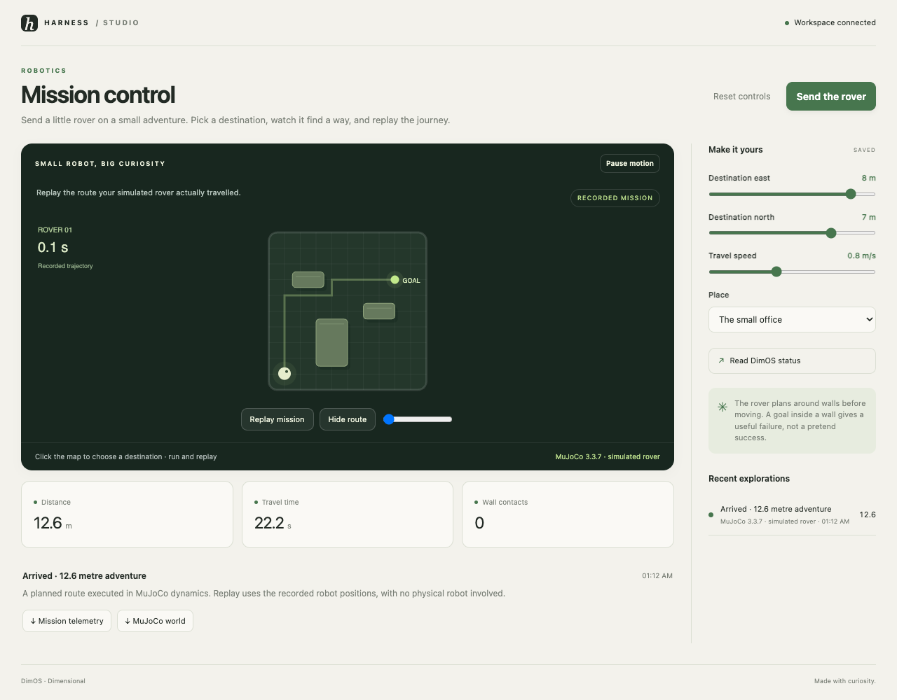

# DimOS · Mission control

Send a little rover on a small adventure. Pick a destination, watch it find a way, and replay the journey.



```sh
harness dsh install autonomous/dimos
```

Open a workspace in Harness. Setup fetches upstream sources at the commit in `upstream.lock.json`,
installs a package-local Python 3.11 environment, and verifies the local tools. The starter runs
without credentials or a cloud account. Studio Viewer provides controls, history, downloads,
live agent updates, and failure recovery. Setup never edits an application's preferences.

## What runs here

The starter performs A* route planning and real MuJoCo dynamics in an original two-dimensional office rover model. It is not a Unitree robot or physical execution. DimOS is fetched at a pinned source commit; its full daemon and perception stack are an optional, larger installation.

Edit `studio.json`, then run:

```sh
"$STUDIO_TOOLCHAIN/run.sh" simulate  # Send the rover
"$STUDIO_TOOLCHAIN/run.sh" dimos  # Read DimOS status
```

The native command is optional and fails with a useful message when its external runtime is
unavailable. It never silently substitutes sample output. Use the upstream README in `upstream/`
for full native application setup. See `INTEGRATION.md` for the exact bridge and local test scope.

Every successful run owns a new folder under `out/runs/`, a `result.json` with parameters, engine,
source commit, timestamps, measured values, and downloadable artifacts. `.harness/verdict.json`
means the named artifact was produced, not that an engineering or aesthetic claim was certified.
The starter can be regenerated with no network after install.

## Development and testing

Install the shared viewer and this package with `harness dsh install <path> --link`.
`toolchain/doctor.sh` checks the local runtime. The repository's Studio Viewer browser suite
materializes temporary workspaces and exercises each shipped local workflow. Run it from
`store/viewers/studio-viewer` with `npm run test:browser`; exact results live in its `TESTING.md`.

## Credit and stewardship

[DimOS](https://github.com/dimensionalOS/dimos) is maintained by Dimensional. Its sources are
fetched unchanged at `7da08fb303d354e72cd09cd7e0236fa515675665`. Upstream licensing: Apache-2.0; wrapper MIT.
The original license is preserved in `LICENSE-upstream`; dependency terms still apply.

OpenHarness contributors wrote the MIT wrapper, local starter, and viewer integration. This is
an independent integration, not an upstream endorsement. Upstream bugs belong with the upstream
project; wrapper bugs belong in OpenHarness. Maintainers are welcome to take over this package.
