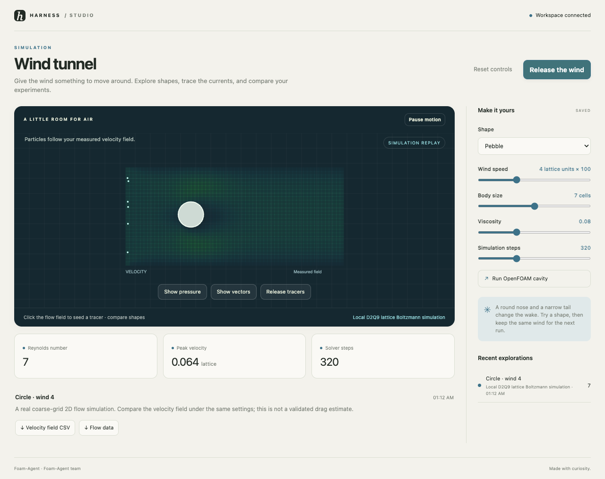

# Foam-Agent · Wind tunnel

Give the wind something to move around. Explore shapes, trace the currents, and compare your experiments.



```sh
harness dsh install autonomous/foam-agent
```

Open a workspace in Harness. Setup fetches upstream sources at the commit in `upstream.lock.json`,
installs a package-local Python 3.11 environment, and verifies the local tools. The starter runs
without credentials or a cloud account. Studio Viewer provides controls, history, downloads,
live agent updates, and failure recovery. Setup never edits an application's preferences.

## What runs here

The local workflow solves a two-dimensional D2Q9 lattice Boltzmann model on a coarse grid. It is an exploratory simulation, not a converged engineering drag analysis. The optional OpenFOAM action reproduces the supplied lid-driven cavity benchmark; Foam-Agent instructions and sources are pinned for richer cases.

Edit `studio.json`, then run:

```sh
"$STUDIO_TOOLCHAIN/run.sh" simulate  # Release the wind
"$STUDIO_TOOLCHAIN/run.sh" openfoam  # Run OpenFOAM cavity
```

The native command is optional and fails with a useful message when its external runtime is
unavailable. It never silently substitutes sample output. Use the upstream README in `upstream/`
for full native application setup. See `INTEGRATION.md` for the exact bridge and local test scope.

Every successful run owns a new folder under `out/runs/`, a `result.json` with parameters, engine,
source commit, timestamps, measured values, and downloadable artifacts. `.harness/verdict.json`
means the named artifact was produced, not that an engineering or aesthetic claim was certified.
The starter can be regenerated with no network after install.

## Development and testing

Install the shared viewer and this package with `harness dsh install <path> --link`.
`toolchain/doctor.sh` checks the local runtime. The repository's Studio Viewer browser suite
materializes temporary workspaces and exercises each shipped local workflow. Run it from
`store/viewers/studio-viewer` with `npm run test:browser`; exact results live in its `TESTING.md`.

## Credit and stewardship

[Foam-Agent](https://github.com/csml-rpi/Foam-Agent) is maintained by Foam-Agent team. Its sources are
fetched unchanged at `9e3e253e76727036585ca6e88e6fc5a762cb62e0`. Upstream licensing: MIT; OpenFOAM: GPL-3.0.
The original license is preserved in `LICENSE-upstream`; dependency terms still apply.

OpenHarness contributors wrote the MIT wrapper, local starter, and viewer integration. This is
an independent integration, not an upstream endorsement. Upstream bugs belong with the upstream
project; wrapper bugs belong in OpenHarness. Maintainers are welcome to take over this package.
