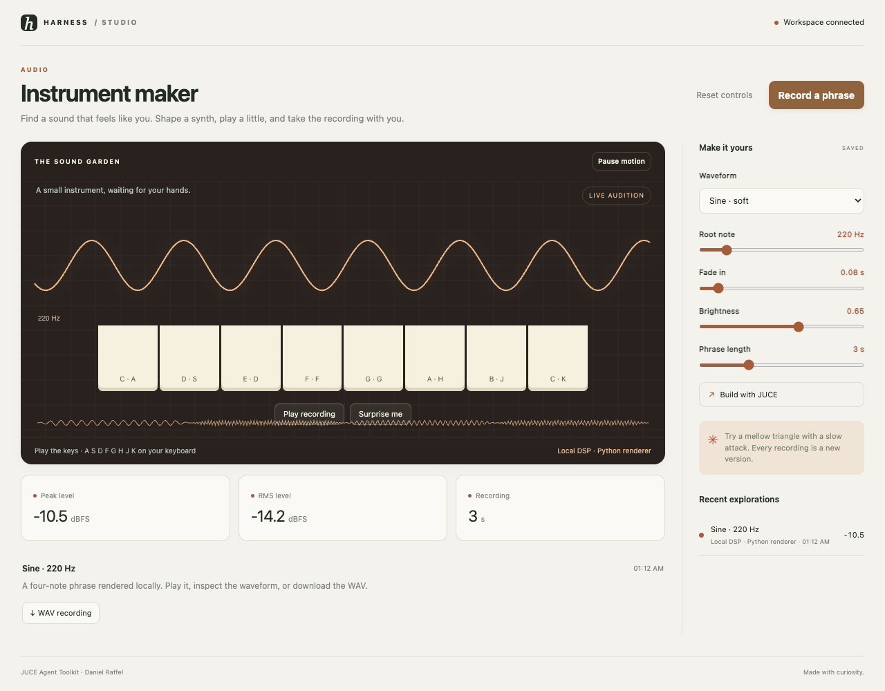

# JUCE Agent Toolkit · Instrument maker

Find a sound that feels like you. Shape a synth, play a little, and take the recording with you.



```sh
harness dsh install autonomous/juce-agent-toolkit
```

Open a workspace in Harness. Setup fetches upstream sources at the commit in `upstream.lock.json`,
installs a package-local Python 3.11 environment, and verifies the local tools. The starter runs
without credentials or a cloud account. Studio Viewer provides controls, history, downloads,
live agent updates, and failure recovery. Setup never edits an application's preferences.

## What runs here

The browser audition and Python WAV renderer are local DSP previews. The JUCE action compiles a native offline renderer from the workspace CMake project. JUCE toolkit skills also cover creating full DAW plugins; the starter renderer is not a VST3 plugin.

Edit `studio.json`, then run:

```sh
"$STUDIO_TOOLCHAIN/run.sh" render  # Record a phrase
"$STUDIO_TOOLCHAIN/run.sh" juce  # Build with JUCE
```

The native command is optional and fails with a useful message when its external runtime is
unavailable. It never silently substitutes sample output. Use the upstream README in `upstream/`
for full native application setup. See `INTEGRATION.md` for the exact bridge and local test scope.

Every successful run owns a new folder under `out/runs/`, a `result.json` with parameters, engine,
source commit, timestamps, measured values, and downloadable artifacts. `.harness/verdict.json`
means the named artifact was produced, not that an engineering or aesthetic claim was certified.
The starter can be regenerated with no network after install.

## Development and testing

Install the shared viewer and this package with `harness dsh install <path> --link`.
`toolchain/doctor.sh` checks the local runtime. The repository's Studio Viewer browser suite
materializes temporary workspaces and exercises each shipped local workflow. Run it from
`store/viewers/studio-viewer` with `npm run test:browser`; exact results live in its `TESTING.md`.

## Credit and stewardship

[JUCE Agent Toolkit](https://github.com/danielraffel/juce-agent-toolkit) is maintained by Daniel Raffel. Its sources are
fetched unchanged at `9089b719f7378eba28dd078cdfb8b6e1c062bf13`. Upstream licensing: MIT; JUCE: AGPL-3.0 or commercial.
The original license is preserved in `LICENSE-upstream`; dependency terms still apply.

OpenHarness contributors wrote the MIT wrapper, local starter, and viewer integration. This is
an independent integration, not an upstream endorsement. Upstream bugs belong with the upstream
project; wrapper bugs belong in OpenHarness. Maintainers are welcome to take over this package.
