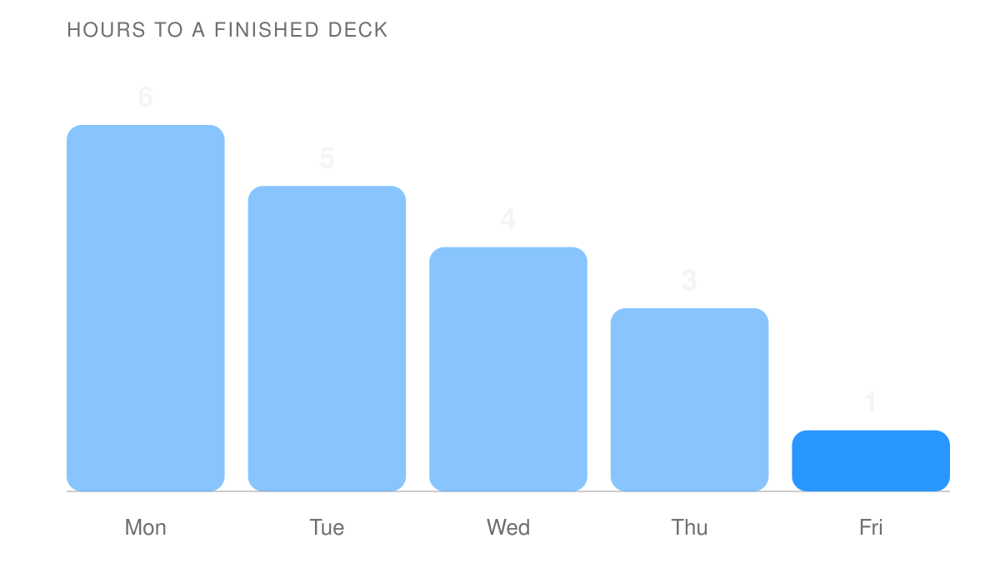

<!-- _class: hero -->

# Say it in one slide.

A keynote, from a sentence.

<!-- Tell me what the talk is for and who is in the room. I write the outline first, then the art, then every slide. -->

---

<!-- _class: statement -->
# Most decks are documents read aloud.

The audience reads ahead. The speaker reads behind.

---

<!-- _class: section -->

# A talk, not a document.

---

<!-- _class: pillars -->
#### What you get
## Three things.

### Copy
Headlines you would say out loud.

### Art
Wallpapers, charts and frames, made here.

### Notes
The argument, in spoken sentences.

---

<!-- _class: number -->
# 10
slides for a ten-minute talk.

---

<!-- _class: chart -->
## Written while you watch.

---

<!-- _class: closing -->
# Tell me the talk.

Who is in the room, what they leave with, how long you have.
