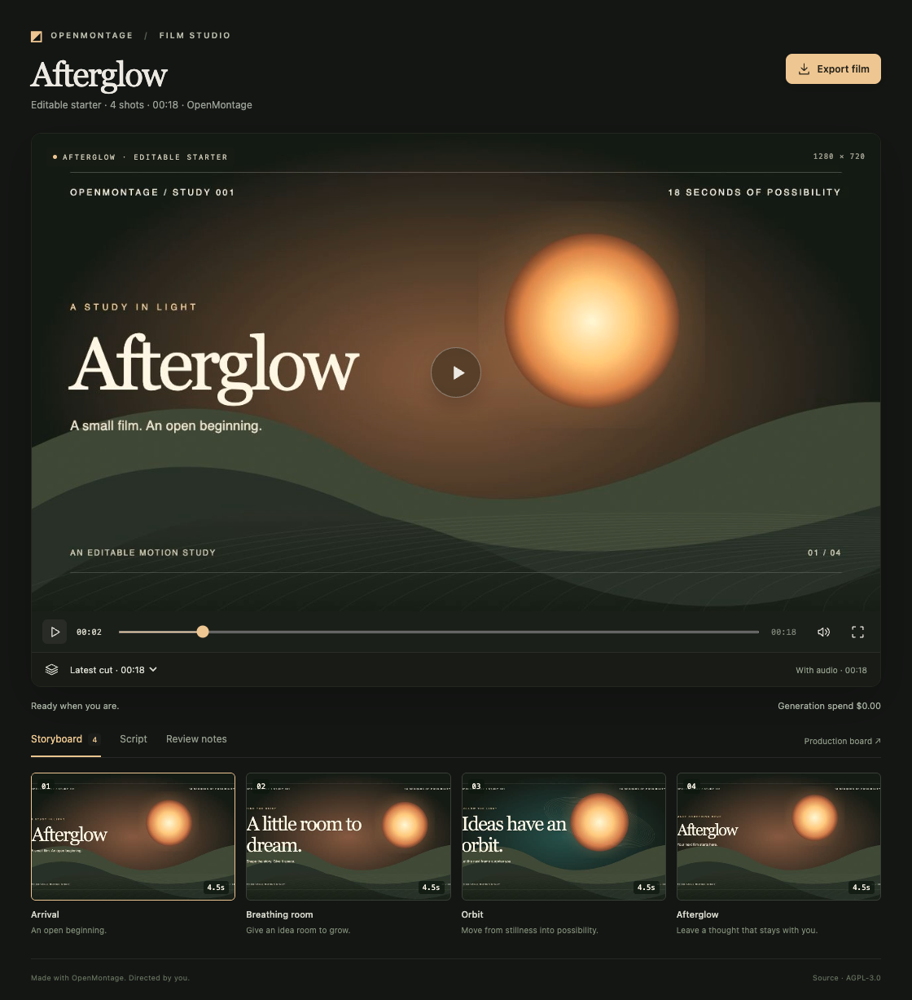

# OpenMontage · Film Director

A film production workspace built on [OpenMontage](https://github.com/calesthio/OpenMontage).
Claude Code works in the agent pane. The other pane is a screening room: watch the screenplay
and storyboard take shape, play completed cuts, and leave notes at a particular moment.



## Try it

Install **OpenMontage** from the Harness Store, or run:

```sh
harness dsh install autonomous/openmontage
```

Open it in New Harness. **Afterglow**, an editable 18-second motion study with an original
ambient score, is ready to play immediately. For a first edit, try:

> Make this a short title film called Golden Hour. Shift the palette toward blue and amber,
> give the second shot more breathing room, and render a new cut. Keep the original version.

The starter uses procedural artwork and synthesized audio. Editing and rendering it does not
call a generation service. Image, video, narration, or music generation through OpenMontage's
provider tools requires the corresponding credentials and an agreed budget.

## The studio

- **Storyboard and script:** read actual production files, refreshed as the agent saves them.
- **Playback:** play, pause, scrub, jump to a scene, mute, or expand the film. Space toggles
  playback; J/L or the arrow keys move two seconds when a text field is not focused.
- **Cuts:** a completed render becomes a new version. A failed render leaves previous cuts
  available. A new cut waits behind **New cut ready** while you watch an earlier version.
- **Review notes:** pause at a moment and save a direction. Notes retain the exact cut and
  timestamp in `review-notes.json`. Ask the agent to apply them; saving a note does not submit
  a chat message or start generation.
- **Export film:** copy the selected movie into `exports/` without overwriting an existing file.
  A download link is also available.
- **Production board:** open OpenMontage's original Backlot board for checkpoint history,
  decisions, and detailed production state.

The viewer reports real render activity and recorded generation spend. Its readiness verdict
checks playable output; it is not an artistic review or a claim that every production is finished.

## Installed tools

Setup fetches the original OpenMontage workflow and Backlot at the SHA in [VERSIONS](VERSIONS),
installs Python dependencies from a hashed lock, and installs its pinned Remotion composer.
It prepares headless Chrome for rendering and uses FFmpeg/ffprobe, downloading a package-local
FFmpeg environment when needed. Python and Node use Harness's shared runtime helpers; installation
does not edit shell profiles. Git and internet access are required for the first installation.

`autonomous/film-viewer` is a shared viewer dependency, installed automatically and reused if it
is already present. Both packages live under `~/.harness/dsh/autonomous/`.

The included renderer supports OpenMontage's bespoke **Remotion atelier** path. It does not install
local generation models, voices, or HyperFrames. Other upstream runtimes need their own setup.
Remotion has [separate licensing terms](https://www.remotion.dev/docs/license); OpenMontage's AGPL
license does not replace them.

Verified on macOS Apple Silicon. Linux has runtime helpers but this package has not been verified
there; Windows is not supported by these shell scripts and file locks. Use the app on the machine
running the harness: remote viewer forwarding remains a platform requirement.

## Develop

```sh
harness dsh check "$PWD/store/agents/openmontage"
harness dsh install "$PWD/store/viewers/film-viewer" --link
harness dsh install "$PWD/store/agents/openmontage" --link
```

Inside a workspace, `$OPENMONTAGE` supplies the installed tools:

```sh
"$OPENMONTAGE" preflight
"$OPENMONTAGE" render --scale 0.5   # draft
"$OPENMONTAGE" render               # full resolution
"$OPENMONTAGE" python your_script.py
```

`film.json` selects `projects/<slug>/`. Each production contains its own script, scene plan,
composition, media, cuts, checkpoints, and notes. The wrapper calls the actual upstream
`VideoCompose` tool, checks the output with ffprobe and a complete FFmpeg decode, then publishes
the cut atomically. Separate staging directories isolate simultaneous productions.

See [AGENTS.md](AGENTS.md) for the workspace contract and [TESTING.md](TESTING.md) for repeatable
browser, render, and installation checks.

## Credit and stewardship

[OpenMontage](https://github.com/calesthio/OpenMontage) is calesthio's project, licensed under
AGPL-3.0. Its workflows, production tools, and Backlot remain in the pinned upstream checkout.
OpenHarness contributors wrote this integration, Film Viewer's screening room, and the Afterglow
starter. These additions are also AGPL-3.0; see [LICENSE](LICENSE) and
[THIRD_PARTY_NOTICES.md](THIRD_PARTY_NOTICES.md).

This is an independent integration, not an upstream endorsement. Wrapper issues belong in
OpenHarness; OpenMontage issues belong upstream. Upstream maintainers are welcome to take over
the package or move it to a repository they maintain.
