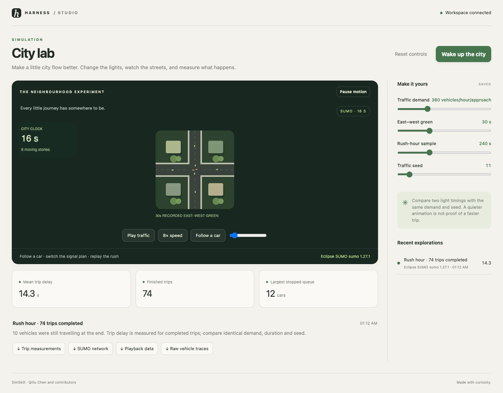

# SimSkill · City lab

Make a little city flow better. Change the lights, watch the streets, and measure what happens.



```sh
harness dsh install autonomous/simskill
```

Open a workspace in Harness. Setup fetches upstream sources at the commit in `upstream.lock.json`,
installs a package-local Python 3.11 environment, and verifies the local tools. The starter runs
without credentials or a cloud account. Studio Viewer provides controls, history, downloads,
live agent updates, and failure recovery. Setup never edits an application's preferences.

## What runs here

The local workflow generates an original four-way intersection with SUMO netconvert and simulates actual traffic with SUMO. Playback uses its floating-car output. A comparison is a simulation experiment, not a calibrated forecast for a real city. Intel Macs build pinned SUMO 1.27.1 headlessly with package-local Xerces; no Homebrew libraries are required.

Edit `studio.json`, then run:

```sh
"$STUDIO_TOOLCHAIN/run.sh" simulate  # Wake up the city
```

SUMO is the local simulator and is installed by setup. The first Intel Mac install compiles two
headless tools and can take several minutes. Later installs reuse the pinned build. It never
substitutes sample output. See `INTEGRATION.md` for the exact local test scope.

Every successful run owns a new folder under `out/runs/`, a `result.json` with parameters, engine,
source commit, timestamps, measured values, and downloadable artifacts. `.harness/verdict.json`
means the named artifact was produced, not that an engineering or aesthetic claim was certified.
The starter can be regenerated with no network after install.

## Development and testing

Install the shared viewer and this package with `harness dsh install <path> --link`.
`toolchain/doctor.sh` checks the local runtime. The repository's Studio Viewer browser suite
materializes temporary workspaces and exercises each shipped local workflow. Run it from
`store/viewers/studio-viewer` with `npm run test:browser`; exact results live in its `TESTING.md`.

## Credit and stewardship

[SimSkill](https://github.com/qiliuchn/SimSkill-V1) is maintained by Qiliu Chen and contributors. Its sources are
fetched unchanged at `10113c1e6ba28b57b48a38a7c25ee113b49ab4e6`. Upstream licensing: Apache-2.0; SUMO EPL-2.0 / GPL-2.0.
The original license is preserved in `LICENSE-upstream`; dependency terms still apply.

OpenHarness contributors wrote the MIT wrapper, local starter, and viewer integration. This is
an independent integration, not an upstream endorsement. Upstream bugs belong with the upstream
project; wrapper bugs belong in OpenHarness. Maintainers are welcome to take over this package.
