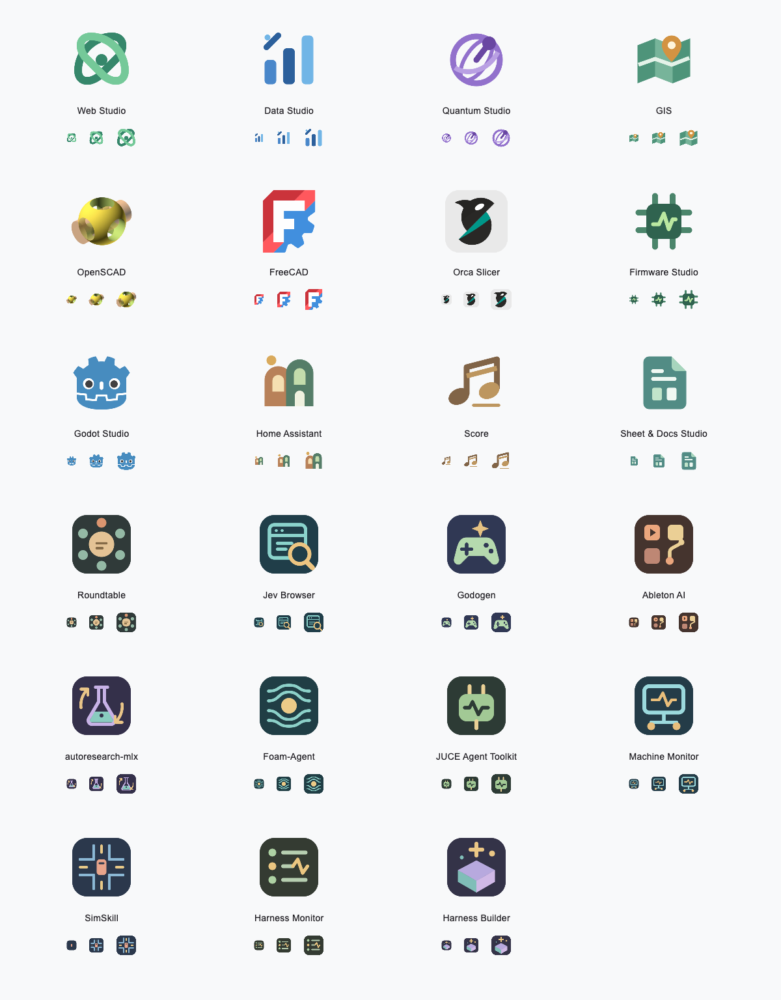
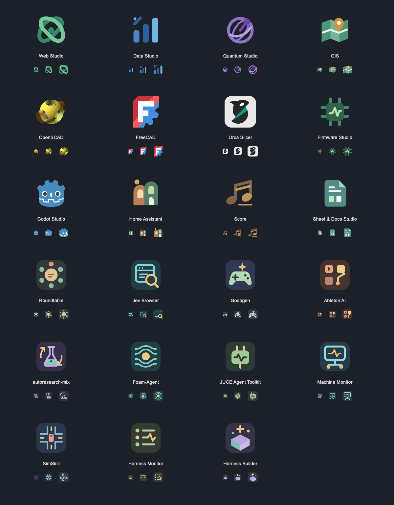

# Harness marks

Logo sources for creative, engineering, and research harnesses, with matching
256 × 256 PNG icons bundled by Harness Desktop. The shared `EngineIdentity` map
uses them in Store listings, New Harness, pane headers, history and native tabs.
These are desktop assets, not remote catalog fields: publishing the Store alone
does not update the icons in an installed app. A desktop release is required.

The real Flutter `EngineMark` widget, rendered at 96, 16, 24 and 32 px:




## Artwork and provenance

| Harness | Mark | Artwork license |
|---|---|---|
| Web Studio | Original interwoven web loops | MIT |
| Data Studio | Original bars and analysis spark | MIT |
| Quantum Studio | Original orbit / Bloch-sphere motif | MIT |
| GIS | Original folded map and location pin | MIT |
| OpenSCAD | Official upstream 256 px icon, copied unchanged | GPL-2.0-or-later |
| FreeCAD | Official upstream F / gear icon | LGPL-2.1-or-later |
| Orca Slicer | Official upstream OrcaSlicer icon | AGPL-3.0-only |
| Firmware Studio | Original chip and signal | MIT |
| Godot Studio | Official Godot Engine icon, Andrea Calabró (2017) | CC-BY-4.0 |
| Home Assistant | Original Habitat architectural mark | MIT |
| Score | Original paired musical notes | MIT |
| Sheet & Docs Studio | Original document and cell grid | MIT |
| Roundtable | Original table with six seats and a decision at its center | MIT |
| Jev Browser | Original browser window and evidence-search lens | MIT |
| Godogen | Original Harness package icon: game controller and creation spark | MIT |

The catalog audit on 2026-09-21 added eight original wrapper marks:

| Harness | Mark | Artwork license |
|---|---|---|
| Ableton AI | Clip pads and an automation curve | MIT |
| autoresearch-mlx | Experiment flask and iteration arrows | MIT |
| Foam-Agent | Flow lines around an obstacle | MIT |
| JUCE Agent Toolkit | Audio plugin and waveform | MIT |
| Machine Monitor | Computer display and connected machines | MIT |
| SimSkill | Traffic intersection and a vehicle | MIT |
| Harness Monitor | Status rows and an activity trace | MIT |
| Harness Builder | Building block and creation spark | MIT |

Harness Monitor and Harness Builder are locally linked tools, not public catalog
entries. Their marks are recognized when a daemon reports them; bundling an icon
does not add an installable product to the Store.

[`marks.json`](marks.json) records each source, credit and license. Upstream GitHub
sources are pinned to commits; Godot's official press asset is vendored and pinned
by its SHA-256 in [`rendered.json`](rendered.json). The SVG originals retain their
shapes, colors and aspect ratios when rasterized. No third-party artwork is
relicensed under this repository's MIT license. Copyright and license notices
from [`licenses/`](licenses/) are also included in the shipped app's
[`NOTICE.txt`](../../desktop/assets/engine-icons/NOTICE.txt).

Upstream policy references:

- [Godot press kit](https://godotengine.org/press/) and
  [logo attribution](https://github.com/godotengine/godot/blob/master/misc/logo/LICENSE.txt).
- [FreeCAD licensing and trademark policy](https://github.com/FreeCAD/FreeCAD-documentation/blob/main/wiki/License.md).
- [OpenSCAD source and license](https://github.com/openscad/openscad/tree/033ddb6f6aafa7f3042b6ff2b7f60c5ecf59f926).
- [OrcaSlicer source and license](https://github.com/OrcaSlicer/OrcaSlicer/tree/8500fcdccaa10b5099ac20d252af3a7c560046f1).

Project names and marks identify the tools the harnesses work with; they do not
imply sponsorship or endorsement. Habitat identifies our wrapper, not upstream
Home Assistant. We deliberately do not distribute the Home Assistant logo:
its [logo policy](https://github.com/home-assistant/assets/blob/master/logo/README.md)
restricts commercial promotional use without written permission.

Godogen's [upstream tree](https://github.com/htdt/godogen/tree/05cebffc8b10c5817e8a3db495b82e7b6004ab84)
contained no logo or image assets when checked on 2026-09-20. The original icon here identifies
the Harness package; it is not presented as Godogen's official mark or the Godot Engine logo.

The wrapper repositories below had no dedicated logo assets when checked on
2026-09-21. Their original package marks above are not upstream project logos:

- [Ableton AI](https://github.com/freekmurze/ableton-ai/tree/2baa8b79c00f48d925b080f3719a7b892f64d86c).
  Ableton's [branding guidelines](https://www.ableton.com/en/legal/branding-trademark-guidelines/)
  rule out using the Ableton logo or Live icon as a compatibility mark.
- [autoresearch-mlx](https://github.com/trevin-creator/autoresearch-mlx/tree/766a25ff22afa799efd8d0aa450a4348e4749df2).
- [Foam-Agent](https://github.com/csml-rpi/Foam-Agent/tree/ed8db9415eb7941e47a0a319b611f29e747087f5).
- [JUCE Agent Toolkit](https://github.com/danielraffel/juce-agent-toolkit/tree/9089b719f7378eba28dd078cdfb8b6e1c062bf13).
- [SimSkill](https://github.com/qiliuchn/SimSkill-V1/tree/43d65a6fe3858af682ac99f6695310ec59dd2f52).

## Regenerate and check

From the repository root, using Node and an installed Playwright Chromium:

```sh
node desktop/tool/harness_marks.mjs
node desktop/tool/harness_marks.mjs --check
```

On macOS, AppKit can render local vector sources without a browser. The original
marks can be rendered this way; `--only` preserves every other recorded PNG:

```sh
node desktop/tool/harness_marks.mjs --appkit --only=roundtable,jev-browser,godogen
node desktop/tool/harness_marks.mjs --check
```

If Playwright is installed outside this checkout, set `PLAYWRIGHT_MODULE` to its
absolute `index.mjs` path. Rendering decodes SVGs as images, blocks network loads,
preserves transparency and records source/output hashes. `--check` needs no
browser: it verifies those hashes, 256 px dimensions, a 100 KiB icon size ceiling,
and the generated artwork notices. Commit the sources, PNGs, notices and receipt
together. Review the pictures again when the Chromium renderer changes.

Use the release-pinned Flutter SDK (see `desktop/RELEASE.md`) for real widget QA:

```sh
cd desktop
HARNESS_ICON_QA_DIR=/private/tmp/harness-icons-qa \
  flutter test test/group_a_identity_test.dart
flutter test test/engine_identity_test.dart test/store_screen_test.dart \
  test/store_page_test.dart test/swarm_screen_test.dart
```

The dedicated test checks all registered identities against their actual package
metadata, decodes every PNG, and renders each mark at 16, 24, 32 and 96 px in both
themes. With `HARNESS_ICON_QA_DIR` set, it writes `icons-light.png` and
`icons-dark.png` for visual inspection. Test captures are review evidence, not
new source artwork. To refresh the previews above, set the output directory to
`../store/branding/previews` when running the dedicated test from `desktop/`.
