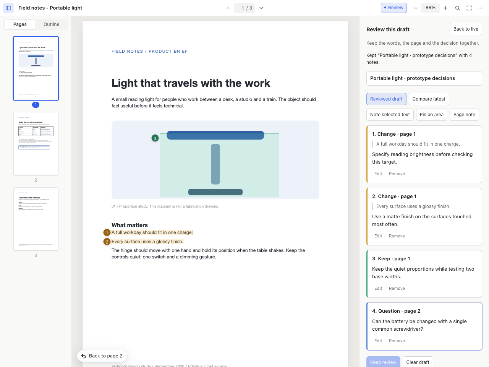

# Doc Viewer, a Harness viewer package

The pane for documents in [Harness](https://github.com/autonomous-ai/openharness): the PDF a
harness is writing, read the way Preview reads it — page thumbnails and the outline, fit and zoom,
two-page spreads, find, links that work, a present mode — and **live**: every compile slides in at
the page, offset and zoom you were reading, with the pages that changed marked. A harness points at
it with

```json
"viewer": { "use": "autonomous/doc-viewer" }
```

and names the PDF in its verdict's `artifact` (or lets the newest `.pdf` under the workspace win).
Typst uses it; anything that compiles to PDF can (LaTeX, LibreOffice exports of docx/pptx/xlsx).

## What the pane does

- **Pages** — continuous scroll, single page, two pages, two pages with the cover alone. pdf.js's own
  `PDFViewer` renders them: only the pages near the view, HiDPI canvases, a detail canvas past the
  canvas-size limit so 500% stays crisp, a text layer (select and copy) and a link layer.
- **Sidebar** — page thumbnails (current page tracked, pages the last compile changed dotted) and the
  PDF's outline (Typst writes one bookmark per heading), with the section you are reading
  highlighted. It pushes the page in a wide pane and floats over it in a narrow one.
- **Zoom** — automatic, fit width, fit page, actual size, presets, ± steps, pinch or ⌘-scroll at the
  pointer. The mode is kept per file and survives a reload.
- **Find** — ⌘F or `/`: every match highlighted, `3 of 12`, next and previous, match case, whole words.
- **Links** — internal links and outline entries jump (with a *Back to page n* chip and ⌘[);
  hovering shows where a link goes; web and mail links open in the default browser.
- **Present** — the current page fitted to a black screen, arrows, space or a click to advance.
- **Review** — hold the exact PDF you are reading, select a passage or draw a rectangle, and leave
  a **Change**, **Keep** or **Question** note. The draft and its anchors stay still while the agent
  compiles. Compare the latest PDF deliberately; a quoted note finds its exact words even when
  they move to another page. Missing or repeated wording is reported, never silently reassigned.
- **Live** — the server watches the workspace. A new PDF is laid out off-screen at the live view's
  place and swapped in once its visible pages are painted: no flash, no jump. When the text at the
  top of the view still exists nearby, that line is held exactly where it was, so a paragraph added
  above what you read pushes nothing away. Each version's pages are drawn small and hashed; the ones
  that differ from the previous version flash, get a dot in the sidebar, and a toast offers to show
  them when they are off-screen.
- **Build state** — a source file newer than the PDF and the verdict shows *Compiling…*; a verdict
  that failed after the last good PDF shows the errors over the last good pages, with the source
  lines and the column (`file:line:col` refs are read from the workspace). Warnings are a quiet chip.
- **Chrome** — light, dark or matching the system; pages always keep their own colours. Every
  shortcut is under `?`. Download, print, open in the default app and show in Finder are in the
  menu (the last two through the server, so they work inside the app's WKWebView).
- **Empty** — before the first PDF: what will appear and what is being watched, or *Compiling…*, or
  the first compile's error.

## Carry the review into the next draft

Choose **Review → Hold this draft**. Select text in the PDF, then **Note selected text**, or use
**Pin an area** / **Page note**. Name the review and choose **Keep review**. The library can reopen
it after a restart or even after the original PDF has been removed. **Back to live** resumes agent
updates and retains the unsaved review in this tab; **Reviewed draft** returns to it. Reloading the
tab loses unsaved work.

Each keep creates an immutable `.harness/doc-reviews/<id>/` packet:

- `reference.pdf` — the exact bytes held by the native reader, identified by SHA-256.
- `review.md` — readable feedback, page numbers and selected quotations for you and the agent.
- `review.json` — the same notes with page-relative highlight rectangles.
- `review.zip` — the portable PDF, notes and explanation, downloadable from the library.

Ask the agent to read the packet's `review.md`, inspect `reference.pdf` where needed, and revise
the original editable source. Keep the packet as the record of that decision. A save does not
rewrite the source, compile a new document, or put notes into the PDF as native annotations.
The archive contains the reviewed PDF and feedback; editable source and linked assets remain in
the workspace. Download PDF and Print use the displayed PDF bytes, including during review.

**Compare latest** uses exact normalized quotation matching, not semantic matching or an automatic
approval of the revision. A unique quotation can locate a note on another page; a repeated or
changed quotation needs human inspection. Area and page notes stay anchored to the reviewed PDF.
Text selection requires a PDF text layer; scanned pages can still receive region and page notes.
Reviews support PDFs up to 30 MB / 500 pages and 100 notes, each up to 2,000 characters. The pane
supports narrow layouts, but native mobile-browser PDF gestures have not been independently tested.



[Watch the native review workflow](../../../docs/images/doc-review-demo.mp4) ·
[Compare a later revision](../../../docs/images/doc-review-latest.png) ·
[Narrow layout](../../../docs/images/doc-review-mobile.png)

## Files

| | |
|---|---|
| `viewer.sh`, `viewer.mjs` | the loopback server Harness starts: the reader, pdf.js from `node_modules`, the workspace read-only under `/ws/`, `/api/state`, `/events` (SSE), `/api/open` |
| `lib/workspace.mjs` | the document state: the PDFs, the newest source, the verdict, `idle` / `building` / `failed`, error snippets |
| `lib/reviews.mjs`, `lib/zip.mjs` | bounded review packets, exact PDF integrity, atomic persistence and portable ZIPs |
| `app/reviews.mjs` | review gestures, anchored notes, deliberate revision comparison and the saved library |
| `app/` | the reader: `index.html`, `app.css`, `app.js` (pdf.js viewer components, no build step) |
| `test/` | `npm test`: the state rules, the server (routes, opening, the live feed) and the shell scripts, on temp workspaces |

pdf.js's modern build needs the newest WebKit (`Map.getOrInsertComputed`, `Math.sumPrecise`, …); an
older macOS gets pdf.js's legacy build from the same package instead. `?legacy=1` forces it.

```sh
./setup.sh && ./doctor.sh           # pdf.js into node_modules, from the lockfile
npm test                            # the state, the server and the scripts
# Native acceptance: Typst, Chrome and a separately installed Playwright module
TYPST=/path/to/typst PLAYWRIGHT_MODULE=/path/to/playwright/index.mjs node test/review-browser.mjs
harness dsh check .                 # conformance
harness dsh install "$PWD" --link   # this checkout as the installed viewer
```

## Credit and stewardship

pdf.js is Mozilla's, Apache-2.0 (`LICENSE-pdfjs`), installed from npm as released and served from
`node_modules`; what it ships with is listed in `THIRD_PARTY_NOTICES.md`. The reader around it is MIT,
Autonomous. Bugs in rendering belong to pdf.js; bugs in the pane belong here.
